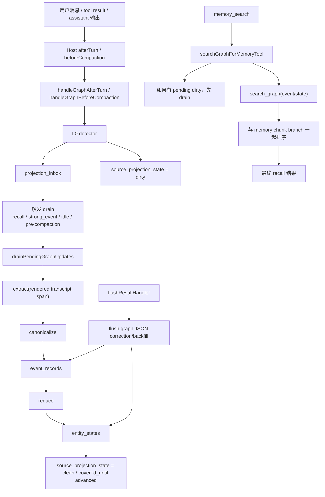

# OpenClaw Graph Index 当前实现链路说明

生成日期：2026-04-19

## 1. 文档目的

这份文档只描述一件事：

> 当前仓库里的 Graph Index 是怎么真正工作的。

它不是目标方案文档，也不是 V0 交付报告的重复版本。这里聚焦的是当前代码里的真实链路：

- graph 的输入从哪里来
- 什么时候会标脏、什么时候会 drain
- 结构化数据落到哪些表
- recall 时 graph 在哪里被用到
- 为什么当前实现要拆成这些层
- 核心函数的伪代码是什么

相关背景文档：

- `openclaw_graph_index_target_design.md`
- `memory-graph-v0-report.md`

---

## 2. 一句话总结

当前 Graph Index 的实现可以概括为：

```text
Feishu/CLI/Web 等真实会话消息
  -> host 在 afterTurn / beforeCompaction 生命周期把 transcript span 交给 memory-core
  -> memory-core 用 L0 detector 做超轻量 signal detection
  -> 把 dirty span 写进 projection_inbox，并更新 source_projection_state
  -> 在 recall / strong_event / idle / pre-compaction 时统一 drain
  -> drain 时批量抽取 dirty span
  -> canonicalize 成 event_records
  -> reduce 成 entity_states
  -> memory_search 把 graph branch 和 memory chunk branch 一起召回并统一排序
```

同时保留一条次要链路：

```text
flushResultHandler
  -> 从 flush 输出里的 graph JSON 做 correction / backfill
```

所以当前 graph 的主输入已经是：

- `afterTurn` transcript span
- `beforeCompaction` catch-up span

而不是：

- `MEMORY.md`
- `memory/YYYY-MM-DD.md`

Markdown 现在仍然保留，但角色是：

- durable memory
- 人类可审计记忆
- correction / provenance / 回读原文

---

## 3. 为什么当前实现这么分层

### 3.1 为什么不用“每轮一次完整抽取”

如果每个 turn 都直接跑完整 extractor，成本模型会退化成：

```text
O(turns)
```

这对高活跃 session 不可接受。当前实现把链路拆成两层：

- `afterTurn` 只做超轻量标脏
- `drainPendingGraphUpdates()` 才做真正批量抽取

这样成本模型更接近：

```text
O(batches)
```

### 3.2 为什么保留 `projection_inbox`

因为 drain 不能再次依赖 host 去回读任意 transcript 历史。  
`projection_inbox` 的作用是把待处理 span 快照直接保存下来，后续 recall / idle / pre-compaction 都能直接消费。

### 3.3 为什么保留 `source_projection_state`

因为 graph 需要一个每个 source 一行的状态机，记录：

- 当前 clean 还是 dirty
- 已经覆盖到哪个 entry
- dirty 是从哪里开始的
- 上次成功投影是什么时候

它和 `projection_inbox` 有关联，但不是同一类对象：

- `projection_inbox` 是队列
- `source_projection_state` 是 cursor/state machine

### 3.4 为什么保留 `event_records` 和 `entity_states`

当前实现把 graph 明确拆成：

- 事实层：`event_records`
- 当前视图层：`entity_states`

这样既能回答：

- “发生过什么变化”

也能回答：

- “现在状态是什么”

---

## 4. 主要代码入口

### 4.1 Plugin 注册入口

`extensions/memory-core/index.ts`

这里把 graph 相关能力注册到统一 memory capability：

- `flushResultHandler: handleGraphFlushResult`
- `afterTurnObserver: handleGraphAfterTurn`
- `beforeCompactionObserver: handleGraphBeforeCompaction`

### 4.2 Host / capability seam

`src/plugins/memory-state.ts`

这里定义了 memory capability 的公共接口，host 不需要知道 memory-core 的内部实现，只需要把标准化 transcript span 传进来。

### 4.3 afterTurn host wiring

`src/agents/pi-embedded-runner/run/attempt.context-engine-helpers.ts`

run 完成一轮后，host 会触发 context-engine 的 afterTurn，再通过 memory capability observer 把本轮新增 transcript span 交给 memory-core。

### 4.4 Graph runtime 主入口

`extensions/memory-core/src/canonical/index.ts`

这里统一导出：

- `handleGraphAfterTurn`
- `handleGraphBeforeCompaction`
- `drainPendingGraphUpdates`
- `handleGraphFlushResult`
- `searchGraphForMemoryTool`

---

## 5. 整体流程图



---

## 6. 更新链路

## 6.1 afterTurn：主增量观测与标脏点

核心代码：

- `extensions/memory-core/src/canonical/projection.ts`

`handleGraphAfterTurn()` 的职责不是做完整抽取，而是：

1. 对本轮新增 span 运行轻量规则 detector
2. 如果没有结构化信号，则记录 `after_turn_clean`
3. 如果命中信号，则：
   - `enqueueProjectionInbox(...)`
   - 更新 `source_projection_state`
   - 记录 `after_turn_mark_dirty`
   - 安排 idle drain
   - 如果命中强事件，异步安排 `strong_event` drain
   - 如果累计阈值达到，也安排 `dirty_threshold` drain

当前 detector 主要看这些信号：

- `status`
- `owner`
- `decided`
- `blocked`
- `done`
- `due`
- `assigned`
- `remember`
- `update`
- task / issue / ticket / decision / project 样式
- tool result 里的状态信号

### 6.1.1 afterTurn 伪代码

```ts
function handleGraphAfterTurn(params) {
  if (!graphEnabled || params.entries.length === 0) return;

  detected = detectTranscriptSignals(params.entries);
  sourceId = resolveSourceId(params);
  traceId = projectionTraceId(sourceId, firstEntryId, lastEntryId);

  if (!detected.dirty) {
    trace("after_turn_clean");
    return;
  }

  inserted = store.enqueueProjectionInbox({
    source_id: sourceId,
    first_entry_id,
    last_entry_id,
    entries_json: JSON.stringify(params.entries),
    dirty_reason: detected.dirtyReason,
    signal_strength: detected.signalStrength,
    strong_event: detected.strongEvent,
  });

  trace("after_turn_mark_dirty");

  scheduleIdleDrain(sourceId, traceId);

  if (detected.strongEvent) {
    scheduleAsyncDrain(sourceId, "strong_event", traceId);
  } else if (dirtyThresholdReached(sourceId)) {
    scheduleAsyncDrain(sourceId, "dirty_threshold", traceId);
  }
}
```

## 6.2 beforeCompaction：强制 catch-up

核心代码：

- `extensions/memory-core/src/canonical/projection.ts`

`handleGraphBeforeCompaction()` 的语义是：

- compaction 之前，把即将被压缩掉的 transcript span 先写入 `projection_inbox`
- 然后同步执行一次 `drainPendingGraphUpdates(..., reason="pre_compaction")`

这是为了避免旧 transcript 在 compaction 之后只剩 summary，导致结构化关系丢失。

### 6.2.1 beforeCompaction 伪代码

```ts
function handleGraphBeforeCompaction(params) {
  enqueueProjectionInbox({
    source_id,
    first_entry_id,
    last_entry_id,
    dirty_reason: "pre_compaction",
    strong_event: true,
  });

  trace("before_compaction_catchup");

  await drainPendingGraphUpdates({
    sourceId,
    reason: "pre_compaction",
  });
}
```

## 6.3 drain：唯一允许做批量抽取的入口

核心代码：

- `extensions/memory-core/src/canonical/projection.ts`

`drainPendingGraphUpdates()` 是当前实现里唯一真正跑 extractor 的入口。

它会：

1. 从 `projection_inbox` 取出 pending rows
2. 解析成整段 dirty span
3. `renderProjectionBatch(...)`
4. 调用 `extract(...)`
5. `canonicalize(...)`
6. `upsertEvents(...)`
7. `refreshEntityStates(...)`
8. `markProjectionDrained(...)`
9. 推进 `covered_until_entry_id`

### 6.3.1 drain 伪代码

```ts
async function drainPendingGraphUpdates({ sourceId, reason }) {
  summaries = store.listPendingProjectionSummaries(sourceId);

  for (summary of summaries) {
    if (alreadyDraining(summary.source_id)) continue;

    traceId = projectionTraceId(summary.source_id, summary.first_entry_id, summary.last_entry_id);
    store.markProjectionSourceDraining(summary.source_id);

    rows = store.listPendingProjectionInbox(summary.source_id);
    entries = parseInboxEntries(rows);

    trace("drain_started");

    if (entries.length === 0) {
      store.markProjectionDrained(...);
      continue;
    }

    rendered = renderProjectionBatch(summary.source_id, entries);
    rawEvents = await extract(rendered.text, rendered.sourceRef);

    trace("extractor_completed", rawEvents);

    if (rawEvents.length > 0) {
      records = canonicalize(rawEvents, EXTRACTOR_VERSION, {
        sourceType: "transcript",
        sessionId: summary.source_id,
        coveredUntilEntryId,
      });

      await store.upsertEvents(records);
      trace("events_persisted", records);

      states = await store.refreshEntityStates(records);
      trace("entity_states_merged", states);
    }

    store.markProjectionDrained({ sourceId, coveredUntilEntryId });
    trace("cursor_advanced");
  }
}
```

---

## 7. Recall 链路

## 7.1 `memory_search` 如何接入 graph

核心代码：

- `extensions/memory-core/src/tools.ts`
- `extensions/memory-core/src/canonical/index.ts`

当前 `memory_search` 是 hybrid recall：

1. 先跑原有 memory chunk search
2. 再跑 `searchGraphForMemoryTool(...)`
3. 最后统一排序，而不是简单把 graph 永远 append 到末尾

### 7.1.1 recall 之前会先 drain

`searchGraphForMemoryTool()` 会先检查：

```ts
store.hasPendingProjection(sessionKey)
```

如果当前 session 还有 pending dirty span，就会：

1. 记录 `memory_search_pending_drain`
2. 同步执行 `drainPendingGraphUpdates(..., reason="recall")`

这保证了 recall 不会读到过期 graph。

### 7.1.2 recall 伪代码

```ts
async function searchGraphForMemoryTool({ query, sessionKey }) {
  if (!graphEnabled) return empty;

  if (store.hasPendingProjection(sessionKey)) {
    trace("memory_search_pending_drain");
    await drainPendingGraphUpdates({
      sourceId: sessionKey,
      reason: "recall",
    });
  }

  hits = await search_graph(store, query, k);
  rendered = hits.map(graphHitToMemorySearchResult).filter(Boolean);

  trace("memory_search_graph_hits", rendered);

  return {
    enabled: true,
    hits: hits.length,
    renderedHits: rendered.length,
    results: rendered,
  };
}
```

## 7.2 `search_graph()` 怎么查

核心代码：

- `extensions/memory-core/src/canonical/retriever.ts`

当前实现是轻量 event/state 搜索，不是复杂 GraphRAG：

- 从 `event_fts` 找候选
- 结合 `entity_states`
- 做轻量 recentness / diversity 规则
- 同一 entity 最多保留有限条 state/event
- 最后渲染成 `memory_search` 结果格式

---

## 8. Flush correction 链路

核心代码：

- `extensions/memory-core/src/canonical/index.ts`

`handleGraphFlushResult()` 仍然存在，但角色已经降级为：

- correction
- backfill
- provenance-enhanced flush path

它不再是 graph 的主入口。

当前 flush correction 会：

1. 从 flush 输出里解析 graph JSON
2. 校验 `source_ref`
3. `canonicalize(...)`
4. `upsertEvents(...)`
5. `refreshEntityStates(...)`

这条链保留的原因是：

- graph 仍然需要兼容已有 flush 产物
- flush 有时会提供 transcript extractor 没抓到的补充结构化信息

---

## 9. 当前数据库表

## 9.1 核心表

### `projection_inbox`

作用：待抽取 dirty span 队列

核心字段：

- `source_kind`
- `source_id`
- `first_entry_id`
- `last_entry_id`
- `entries_json`
- `dirty_reason`
- `signal_strength`
- `strong_event`
- `created_at`
- `drained_at`

语义：

- 一条 row 代表一个待处理 transcript span 快照
- `entries_json` 是为了让后续 drain 不需要重新依赖 host transcript 读取能力

### `source_projection_state`

作用：每个 source 的单行 cursor / 状态机

核心字段：

- `source_kind`
- `source_id`
- `covered_until_entry_id`
- `dirty_since_entry_id`
- `last_projected_at`
- `projection_version`
- `status`

语义：

- 表示这个 source 当前是 `clean / dirty / draining / failed`
- 以及 graph 已经覆盖到了哪个 entry

### `event_records`

作用：事实层 event ledger

核心字段：

- `event_id`
- `source_type`
- `source_ref`
- `occurred_at`
- `entity_id`
- `actor`
- `action`
- `object`
- `status_before`
- `status_after`
- `session_id`
- `covered_until_entry_id`
- `confidence`

语义：

- 每条记录是一个 canonical event
- 当前 transcript 投影写入时，`source_type = "transcript"`

### `entity_states`

作用：当前状态视图

核心字段：

- `entity_id`
- `latest_status`
- `latest_owner`
- `last_event_id`
- `last_updated_at`
- `entity_type`
- `supporting_event_ids`
- `confidence`

语义：

- 这是 reducer 从 `event_records` 归并出的“当前状态”
- recall 时优先用它回答“现在是什么状态”

## 9.2 非核心增强表

### `recent_graph_hits`

作用：记录 recall 返回过哪些 graph hits，并追踪后续是否被 `memory_get` / assistant output 使用。

这张表偏 observability / usage tracking，不是 graph correctness 的核心依赖。  
如果只追求最小可运行 graph，可以考虑后续删除。

---

## 10. 为什么 `projection_inbox` 和 `source_projection_state` 没有合并

这两张表的服务对象有关联，但不相同。

### `projection_inbox` 关心的是：

- 有哪些 span 在排队
- 这些 span 的原始快照是什么
- 哪些已经被 drain

### `source_projection_state` 关心的是：

- 这个 source 当前的 clean/dirty/draining 状态
- 当前 coverage cursor 在哪里

如果强行合并，会把：

- 多条 pending span
- 单个 source 当前状态

揉在一张表里，导致：

- 队列语义不清晰
- 幂等和失败恢复更难
- pre-compaction catch-up 不够稳

因此当前实现选择分开。

---

## 11. 当前日志和 trace

核心代码：

- `extensions/memory-core/src/canonical/trace.ts`

当前日志分两层：

### 11.1 runtime 摘要日志

tag：

- `GRAPH_INDEX_IMPL`

语义：

- 这是我们自己加的 graph 实现日志
- 用来快速看链路阶段和关键计数

示例：

```text
GRAPH_INDEX_IMPL canonical.projection.after_turn ...
GRAPH_INDEX_IMPL canonical.projection.drain ...
GRAPH_INDEX_IMPL canonical.memory_search.graph_hits ...
```

### 11.2 trace JSONL

默认文件：

- `graph-index-trace.jsonl`

特点：

- 一行一个结构化事件
- 同一条 dirty span 现在会复用同一个 `trace_id`
- 能顺着完整链路看：

```text
after_turn_mark_dirty
  -> drain_scheduled
  -> drain_started
  -> extractor_completed
  -> events_persisted
  -> entity_states_merged
  -> cursor_advanced
```

### 11.3 OpenClaw 原生行为如何标识

trace 里额外有：

- `observed_tags: ["OPENCLAW_RUNTIME"]`

它表示：

- 当前 graph trace 里观测到了 OpenClaw 原生运行行为
- 例如用户消息、tool call、tool result、`memory.md` 读写

也就是说：

- `GRAPH_INDEX_IMPL` 表示“谁在记录”
- `OPENCLAW_RUNTIME` 表示“记录到的上游行为来源”

---

## 12. 当前 reducer 的状态统一方式

核心代码：

- `extensions/memory-core/src/canonical/reducer.ts`
- `extensions/memory-core/src/canonical/store.ts`

当前 reducer 仍然是最小实现：

- 按 `occurred_at`、再按 `created_at` 选每个 entity 的最新事件
- `latest_status = event.status_after ?? previous.latest_status`
- `latest_owner = event.actor ?? previous.latest_owner`

### reducer 伪代码

```ts
function reduce(events, previousStates) {
  byEntity = groupByEntity(events);
  nextStates = [];

  for (entityId of byEntity.keys()) {
    prev = previousStates[entityId] ?? empty;
    latest = pickNewestEvent(byEntity[entityId]);

    nextStates.push({
      entity_id: entityId,
      latest_status: latest.status_after ?? prev.latest_status,
      latest_owner: latest.actor ?? prev.latest_owner,
      last_event_id: latest.event_id,
      last_updated_at: latest.created_at,
      supporting_event_ids: [latest.event_id],
      confidence: latest.confidence,
    });
  }

  return nextStates;
}
```

当前 trace 已经会把 reducer 的这些信息记录出来：

- `previous_states`
- `input_events`
- `next_states`
- `policy`

所以可以直接从 trace 看 state 是怎么合成出来的。

---

## 13. 当前实现的取舍

## 13.1 已经跑通的部分

- transcript-driven graph update
- afterTurn 标脏
- pending dirty span drain
- pre-compaction catch-up
- event/state 落表
- `memory_search` graph recall
- 双层日志和 trace explainability

## 13.2 仍然故意保持简单的部分

- extractor 仍然偏规则 + 轻量抽取
- reducer 仍然只做最小 state merge
- 没有 entity relation graph
- 没有 alias resolver
- 没有复杂 query-aware graph retrieval

## 13.3 当前最小核心闭环

如果只看最重要的 graph 主链，当前闭环是：

```text
turn transcript
  -> projection_inbox
  -> drain
  -> event_records
  -> entity_states
  -> memory_search graph branch
```

这就是当前实现最核心、也最稳定的链路。

---

## 14. 推荐阅读顺序

如果要顺着代码理解当前实现，推荐按这个顺序读：

1. `extensions/memory-core/index.ts`
2. `src/plugins/memory-state.ts`
3. `extensions/memory-core/src/canonical/projection.ts`
4. `extensions/memory-core/src/canonical/store.ts`
5. `extensions/memory-core/src/canonical/reducer.ts`
6. `extensions/memory-core/src/canonical/index.ts`
7. `extensions/memory-core/src/tools.ts`
8. `extensions/memory-core/src/canonical/trace.ts`

如果要顺着测试理解，推荐读：

1. `extensions/memory-core/src/canonical/projection.test.ts`
2. `extensions/memory-core/src/canonical/integration.test.ts`

---

## 15. 结论

当前 Graph Index 的实现已经不再是“扫 Markdown 再建一个结构化索引”的模型，而是：

> 以 transcript span 为主输入、以 projection inbox + cursor 为过渡层、以 event/state 为结构化结果、以 hybrid memory_search 为输出的 graph sidecar。

它之所以这么实现，是因为要同时满足四件事：

1. per-turn 成本不能退化成每轮一次完整抽取
2. recall 前必须能把 pending dirty 同步补齐
3. compaction 前不能丢失细粒度事件关系
4. durable memory 仍然要保留 Markdown 作为人类可审计载体

这就是当前实现链路的核心设计逻辑。
