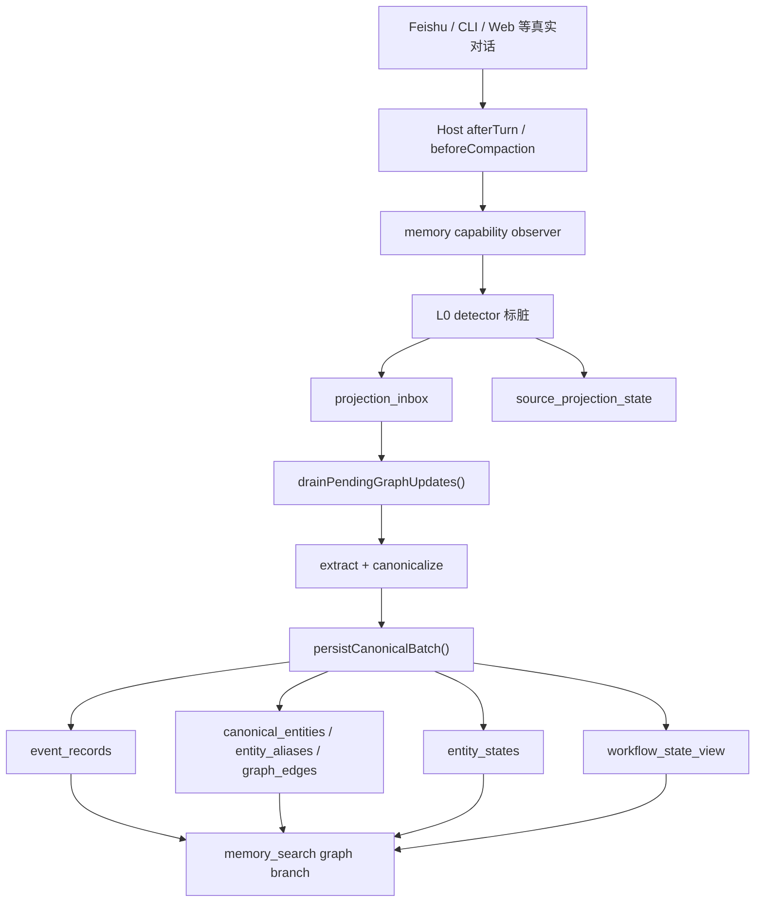

# 课题二：企业级长程协作 Memory 系统技术方案

生成日期：2026-04-19

## 1. 课题概述

### 1.1 课题名称

**企业级长程协作 Memory 系统**

### 1.2 课题定位

本课题聚焦企业跨部门、跨角色、跨周期长程协作场景中的智能体“失忆”、信息断层、上下文漂移、协作状态不可追踪等核心问题，基于飞书 OpenClaw、飞书 CLI、飞书生态与大模型能力，构建具备**全流程记忆管理、结构化状态沉淀、跨轮次回忆与协作状态维护**能力的企业级记忆引擎。

本系统并不是对传统聊天历史做简单存档，也不是单纯的向量检索增强，而是围绕企业协作过程中的“事实、关系、状态、证据、工作流”建立可持续演化的记忆基础设施，使智能体能够从“记住片段信息”升级为“维护长期协作状态”。

### 1.3 课题目标

本课题的最小落地目标包括：

- 在真实企业会话中持续观测 transcript、工具结果、文档回流等信息源
- 将长程对话增量投影为可检索的结构化事件与关系图谱
- 在回忆时提供按状态、关系、时间线、阻塞原因组织的证据组，而非零散命中
- 在现有 Graph Index / 最小知识图谱之上，进一步维护工作对象的当前 workflow state
- 保持系统与 OpenClaw 原生 memory 系统兼容，不引入第二套平行 memory 平台

---

## 2. 问题背景与业务痛点

### 2.1 企业长程协作中的核心问题

在企业真实协作中，一个任务、项目、审批、文档或会议通常会跨越多个时间尺度与信息通道：

- 同一事项会在飞书群聊、私聊、机器人对话、文档评论、任务系统、审批流中反复出现
- 不同角色只掌握局部信息，信息经常分散在多个会话中
- 大模型原生上下文窗口有限，长期协作时会发生“记忆覆盖”“历史丢失”“状态漂移”
- 即使历史消息被保留，系统往往也只能做全文搜索，难以直接回答“现在谁负责、当前卡点是什么、状态怎么演变过”

在这种情况下，智能体会暴露出几类典型缺陷：

- **失忆**：隔几轮后忘记此前明确提过的 owner、status、deadline、decision
- **断层**：知道历史里提过某件事，但拿不出可靠的结构化证据
- **漂移**：旧状态覆盖新状态，或者把弱相关提及误当成当前事实
- **不具备协作连续性**：无法维护任务、项目、审批等对象的当前工作状态

### 2.2 为什么传统方案不够

企业场景中的长期记忆问题，不能只靠以下任一方案解决：

1. 只保存原始 transcript  
   问题是可追溯但不可用。历史消息虽然在，但无法形成状态视图和关系结构。

2. 只做 embedding / 关键词搜索  
   问题是能找到“相关段落”，但很难回答“现在是什么状态”“变化链条是什么”。

3. 每轮都跑一次完整 LLM 抽取  
   问题是成本与延迟不可控，活跃会话下会退化成 `O(turns)`。

4. 单纯维护 latest state  
   问题是会抹平冲突和时间线，无法保留“为什么形成当前结论”的证据链。

因此，本课题采用“**事件账本 + 图关系 + 分组召回 + workflow state projection**”的分层架构，既保留企业级可审计性，又控制在线成本，并为未来跨工具、跨文档、跨会话扩展留出统一接口。

---

## 3. 总体设计思想

### 3.1 核心设计原则

系统围绕以下五条原则设计：

1. **Transcript-driven**  
   主输入来自真实对话 transcript，而不是事后扫描 `MEMORY.md`。

2. **Sidecar projection**  
   不推翻 OpenClaw 现有 memory 架构，而是在其旁路增加结构化 sidecar。

3. **O(batches) 而非 O(turns)**  
   每轮只做极轻量 signal detection，真正抽取放在条件触发的 batch drain 中。

4. **事实与当前状态分层**  
   `event_records` 负责保留事实账本，`entity_states` 负责通用 latest state，`workflow_state_view` 负责协作对象的权威工作状态视图。

5. **统一更新接口**  
   无论未来来源是 transcript、tool_result、flush、backfill 还是 doc_parse，都通过统一状态更新接口进入 workflow state layer。

### 3.2 技术路线概览

当前系统已经形成三层能力：

- **第一层：Graph Index**
  - transcript 增量观测
  - pending dirty span 管理
  - 批量抽取与 canonical event 落库

- **第二层：最小 Knowledge Graph**
  - canonical entities
  - aliases
  - graph edges
  - grouped graph recall

- **第三层：最小 Workflow State Layer**
  - workflow object 当前状态投影
  - slot-level merge
  - state / blocker 视图优先读取

---

## 4. 当前系统总体架构

### 4.1 主链路

当前已实现的主链路如下：



### 4.2 系统分层

当前结构可以理解为五个相互衔接的层：

1. **观测层**
   - 接入 afterTurn / beforeCompaction 生命周期
   - 接收标准化 transcript span

2. **投影层**
   - `projection_inbox`
   - `source_projection_state`
   - `drainPendingGraphUpdates()`

3. **事实层**
   - `event_records`
   - 记录发生过什么、何时发生、由谁触发、对应哪个实体

4. **图谱层**
   - `canonical_entities`
   - `entity_aliases`
   - `graph_edges`
   - 支持 relation-aware retrieval

5. **工作流状态层**
   - `workflow_state_view`
   - 面向企业协作对象的 current state projection

---

## 5. 现有实现的关键能力

## 5.1 增量观测与标脏

当前实现不采用“每轮一次完整抽取”的高成本策略，而是把 `afterTurn` 定义为**主增量观测与标脏点**。

### 机制

- Host 在每轮结束后将新增 transcript span 传给 memory capability
- memory-core 只运行低成本 L0 detector
- 命中结构化信号时，将该 span 快照写入 `projection_inbox`
- 同时更新 `source_projection_state`，记录该 source 已进入 dirty 状态

### 观测的结构化信号

当前实现重点检测以下企业协作信号：

- status 变化
- owner / assigned 变化
- blocker / blocked / depends
- decision / decided_by
- approval / approved / rejected / pending
- next action / todo / follow-up
- task / project / meeting / document 等对象风格

### 工程价值

这种机制的好处是：

- 不把每个 turn 都转化成一次完整 LLM 抽取
- 将成本模型从 `O(turns)` 降为 `O(batches)`
- 保留对强事件和 recall 前 drain 的响应能力

## 5.2 Projection Inbox 与 Cursor State

当前系统使用两张核心 sidecar 表来承接增量观测：

### `projection_inbox`

职责：

- 保存待处理 dirty span 的快照
- 避免 drain 时再次依赖 host 回读原始 transcript
- 支持 recall / idle / pre-compaction 共用同一批待处理输入

关键字段包括：

- `source_kind`
- `source_id`
- `first_entry_id`
- `last_entry_id`
- `entries_json`
- `dirty_reason`
- `signal_strength`
- `strong_event`
- `created_at`
- `drained_at`

### `source_projection_state`

职责：

- 维护每个 source 的 projection 状态机
- 记录当前是 `clean / dirty / draining / failed`
- 记录已覆盖到哪个 entry，以及 dirty 从哪里开始

这两张表功能不同但互补：

- `projection_inbox` 是待处理队列
- `source_projection_state` 是 source 级 cursor 和状态机

## 5.3 Batch Drain 机制

真正的结构化抽取只在 `drainPendingGraphUpdates()` 中发生。

### 触发方式

当前系统支持以下 drain 触发点：

- recall 前 drain
- strong event 触发 drain
- dirty accumulation 触发 drain
- idle drain
- pre-compaction 强制 drain

### 关键思想

drain 的输入不是“当前单轮消息”，而是：

> 从 `dirty_since_entry_id` 到当前边界的一整段 dirty transcript span

这意味着系统不是做单轮单抽，而是：

- 合并 pending span
- 以 batch 为单位抽取 canonical event
- 再统一写入事件、图谱和状态视图

## 5.4 Canonical Event Ledger

当前系统通过 `canonicalize()` 将抽取结果规范化成 `event_records`。

`event_records` 是整个 memory graph 的事实账本，负责记录：

- `event_id`
- `source_type`
- `source_ref`
- `occurred_at`
- `entity_id`
- `actor`
- `action`
- `object`
- `object_type`
- `status_before`
- `status_after`
- `session_id`
- `confidence`

### 作用

`event_records` 的职责不是直接回答所有问题，而是作为：

- 事实保留层
- 重建 graph / workflow projection 的基础层
- 冲突保留层
- 证据回指层

这是系统可审计、可重放、可回溯的关键。

## 5.5 最小 Knowledge Graph

在 `event_records` 之上，系统已经实现了最小知识图谱。

### 图谱表结构

1. `canonical_entities`
   - 记录规范化实体节点

2. `entity_aliases`
   - 记录 exact / normalized / heuristic alias

3. `graph_edges`
   - 记录节点之间的关系边及其证据来源

### 当前支持的强关系

- `assigned_to`
- `owned_by`
- `depends_on`
- `blocks`
- `decided_by`
- `scheduled_for`
- `participated_in`

### 当前支持的弱关系

- `about`
- `mentions`
- `related_to`

### 设计价值

最小 KG 让系统从“事件账本 + 状态表”升级为：

- 节点
- 边
- alias
- 证据

从而支持更稳定的 relation-aware retrieval。

## 5.6 Grouped Graph Recall

在 retrieval 侧，系统已经从“散 hit 返回”升级到 P1a grouped recall。

### 当前 recall 结构

`search_graph()` 内部现在采用：

```text
classifier
  -> entity resolver
  -> fixed planner
  -> aggregator
  -> grouped outputs
  -> bounded hybrid fallback
```

### 支持的 query class

- `state`
- `list`
- `timeline`
- `blocker_why`

### 当前 grouped evidence 的特点

- 支持 freshness 四态：`fresh / mixed / unknown / stale`
- 支持 conflict evidence
- 支持 bounded hybrid fallback
- 支持 strong / weak relation 分层
- 支持统一 trace 与 grouping

### 价值

这一步让 graph recall 不再只是“把几条边和几条事件拼在一起”，而是开始形成：

- 主证据组
- 冲突证据组
- 时间线组
- blocker group

这为 workflow state layer 的接入提供了自然过渡。

---

## 6. 最小 Workflow State Layer

这是目前实现中最关键的新增能力，也是课题申请中最能体现企业协作价值的部分。

## 6.1 为什么要引入 workflow state layer

即使已经有了：

- `event_records`
- `entity_states`
- `graph_edges`
- grouped recall

系统仍然缺少一个对企业协作对象“当前工作状态”的权威视图。

例如，当用户问：

- 这个任务现在谁负责？
- 当前卡点是什么？
- 审批状态到哪一步了？
- 下一步动作是什么？

如果只依赖 event/state/graph，系统虽然能找出证据，但未必能稳定维护一个 current state projection。

因此，当前实现新增：

- `workflow_state_view`
- `applyWorkflowUpdate(update)`

作为企业级 workflow-aware state projection 的最小起点。

## 6.2 Workflow Object 范围

当前 P0 只支持最小对象集：

- `task`
- `project`
- `approval`
- `meeting`
- `document`
- `artifact`

设计上明确避免一开始做过于庞杂的 workflow ontology，先以最小闭集证明系统价值。

## 6.3 Workflow State View 表结构

当前 `workflow_state_view` 已经落地，最小字段包括：

- `object_type`
- `object_id`
- `stage`
- `owner_entity_id`
- `blocker_status`
- `blocker_reason`
- `approval_status`
- `next_action`
- `last_event_id`
- `last_updated_at`
- `supporting_event_ids_json`
- `conflict_flags_json`
- `slot_versions_json`

### 设计要点

1. `object_id` 直接复用 `canonical_entities.entity_id`
2. 主键为 `(object_type, object_id)`
3. 额外使用 `UNIQUE(object_id)` 约束

这意味着在 P0 中：

> 一个 canonical entity 只能落成一个 workflow object row

避免同一对象同时被拆成多条 workflow state。

## 6.4 Workflow Update Contract

系统引入了统一的 `WorkflowUpdate` 抽象，用于承接不同来源的 workflow patch。

当前 update contract 可表达：

- `set`
- `clear`
- `resolve`
- `append`

并显式携带：

- `object_type`
- `object_id`
- `occurred_at`
- `source_kind`
- `source_ref`
- `event_id`
- `confidence`
- `relation_strength`
- `resolution_status`
- `derived.canonical_entity_id`
- `workflow_type_source`

### 价值

这使得未来无论是：

- transcript
- tool_result
- flush
- backfill
- doc_parse

都可以通过相同的状态更新接口进入系统，而不需要为每个来源再各自实现一套状态写入逻辑。

## 6.5 Update Admission 规则

为了避免任意来源都直接改 current state，当前实现引入了明确的 admission 规则。

### 三种 admission 结果

- `current_state_patch`
- `evidence_only`
- `reject`

### 当前默认规则

- `transcript` / `tool_result`
  - 高置信、stable resolution、strong relation 时可直接 patch 当前状态

- `flush`
  - 默认更保守，只有高置信情况下才允许 patch

- `backfill`
  - 默认 `evidence_only`
  - 在 row 不存在时可做初始化 patch

- `doc_parse`
  - 默认更保守
  - 不允许轻易覆盖高置信 transcript/tool_result current state

- `ambiguous/unresolved`
  - 默认不能 patch current state

- `weak relation`
  - 不能直接写 current state

### 作用

该规则体系保证 workflow state 不会因为低质量推导而频繁漂移。

## 6.6 单实体单类型稳定约束

当前实现显式规定：

> 一个 canonical entity 在 P0 中只能稳定映射到一个 workflow object type

如果检测到：

- 同一 `object_id` 在 batch 内派生出多个 `object_type`
- 数据库中已存在不同 type 的 row
- canonical type 与 workflow semantics 冲突

则触发：

- `type_conflict`
- 并将 patch 降级为 `evidence_only` 或 `reject`

这样可以防止 workflow state 裂成两份。

## 6.7 Deterministic Apply Order

为了保证 replay、flush correction、backfill 多次执行后结果稳定，系统为同一 batch 内多个 workflow updates 规定了确定性的应用顺序：

1. `object_type ASC`
2. `object_id ASC`
3. `occurred_at ASC`
4. `source_priority DESC`
5. `admission_priority DESC`
6. `event_id ASC`
7. `update_id ASC`

### 这意味着

- 重放同一批事件不会因为数组顺序不同导致 state 漂移
- backfill 与在线 drain 使用同一 apply 规则
- flush correction 不会绕过 workflow state merge 规则

## 6.8 Idempotency 模型

当前 P0 没有引入独立的 workflow update ledger，而是采用 projection 系统更轻量的幂等策略：

- `slot_versions_json`
  - 防止旧事件覆盖新 slot

- `supporting_event_ids_json`
  - 用 set 语义避免重复追加 evidence

- `conflict_flags_json`
  - 用 set 语义避免重复追加 conflict flag

- `update_id`
  - 作为 deterministic tie-breaker 和 trace/debug key

### 设计收益

这种设计避免在 P0 阶段再造一套“workflow 事件账本”，而是继续以 `event_records` 作为唯一事实账本，workflow state 作为可重建投影。

---

## 7. 一致性、恢复与回补机制

## 7.1 同事务提交

当前系统已经把以下对象放进同一个 canonical batch transaction 中：

- `event_records`
- `canonical_entities`
- `entity_aliases`
- `graph_edges`
- `entity_states`
- `workflow_state_view`

这意味着：

> 只有整批 projection 全部成功，projection cursor 才会推进

### 价值

避免出现以下不一致状态：

- event 已写但 graph 未写
- graph 已写但 workflow state 未写
- entity latest state 与 workflow state 脱节

## 7.2 Pre-compaction 语义

pre-compaction 是本系统的重要企业级可靠性设计点。

当前实现遵循以下语义：

- compaction 前必须尝试 catch-up drain
- 如果 workflow projection 失败：
  - compaction 主流程仍可继续
  - 必须写 retry marker
  - projection cursor 不推进
  - workflow row 不允许部分提交

这保证了：

- 记忆压缩主流程不会被阻断
- graph/workflow projection 的失败也不会被悄悄吞掉

## 7.3 Backfill 两种模式

当前系统支持两种 backfill 模式：

### 模式一：`graph_only`

- 默认模式
- 只从 `event_records` 重建 KG 对象
- 不写 workflow state

### 模式二：`graph_and_workflow`

- 显式 opt-in
- 在重建 graph 的同时重建 workflow projection

### 设计收益

这种双模式设计非常适合企业落地中的灰度与排障：

- 可以先验证 graph 重建逻辑
- 再单独验证 workflow projection 是否一致
- 便于在生产环境中逐步开启 workflow 层

---

## 8. Retrieval 与企业协作问答能力

## 8.1 为什么 grouped recall 对企业场景重要

企业中的长程协作问答并不是简单的检索任务，而是：

- 需要给出当前状态
- 需要给出关键证据
- 需要能解释冲突
- 需要说明时间演化

当前系统已实现 grouped recall，因此回答不再只是“命中了几条历史片段”，而可以组织成：

- state group
- relation list group
- timeline group
- blocker group
- conflict group

## 8.2 当前 planner 的能力边界

当前 P1a 只做最小 planner，不做复杂多跳 GraphRAG。

### 已支持

- `state`
- `list`
- `timeline`
- `blocker_why`

### 已支持的关键特性

- freshness 四态
- strong / weak relation 分层
- bounded hybrid fallback
- conflict evidence 保留
- grouped output 渲染

### 边界

当前系统仍然避免：

- 多跳推理遍历
- 复杂 workflow ontology 推演
- 额外 LLM query classifier / planner 成本

这使得系统当前更适合作为企业级长期记忆底座，而不是一次性做成庞大复杂的推理平台。

## 8.3 Workflow State 对 Planner 的价值

在当前实现中，planner 后续已经具备以下升级路径：

- `state` planner 优先读取 `workflow_state_view`
- `blocker_why` planner 优先读取 blocker 状态与 blocker reason
- `list` / `timeline` 仍以 graph/event 为主

这恰好符合企业场景的真实查询结构：

- “现在什么状态”优先看 current view
- “怎么变成现在这样”再回到事件与关系证据

---

## 9. 真实企业场景下的价值

## 9.1 适配飞书长程协作场景

该系统特别适合以下飞书场景：

- 跨部门项目推进
- 审批与流程协同
- 长周期问题跟踪
- 群聊中任务 owner / status 的多轮变化
- 文档、会话、工具结果混合形成的协作上下文

典型问题包括：

- “FEISHU-231 现在卡在哪里？”
- “这个任务负责人从谁变成了谁？”
- “最近一次审批结论是什么？”
- “当前 blocker 是什么，是否已经解除？”
- “这个项目下一步动作是什么？”

当前系统不是把这些问题当作单轮问答，而是把它们视为：

- 工作对象的 current state 查询
- 历史状态演化查询
- 证据链条查询

## 9.2 对企业智能体的提升

在企业协作环境中，这套 memory 系统将智能体从“对话助手”提升为“长期协作参与者”。

其提升主要体现在：

1. **长期连续性增强**
   - 记住跨轮次、跨周期的任务状态和责任关系

2. **状态可追踪**
   - 不只知道“现在是什么”，还能说明“为什么是这样”

3. **冲突可解释**
   - 不把冲突信息直接覆盖掉，而是保留 conflict evidence

4. **可灰度演进**
   - 从 transcript-driven graph 开始，逐步演进到 workflow-aware state

5. **可扩展到企业生态**
   - 未来可自然接入飞书文档、审批、任务系统和工具回调

---

## 10. 当前已实现的工程成果

截至目前，系统已经完成以下工程落地：

### 10.1 已完成能力

- transcript-driven graph index 主链
- afterTurn / beforeCompaction observer 接入
- `projection_inbox` / `source_projection_state`
- `drainPendingGraphUpdates()` 批量抽取
- `event_records` 事实账本
- `entity_states` 通用 latest state
- 最小 KG：
  - `canonical_entities`
  - `entity_aliases`
  - `graph_edges`
- grouped graph recall：
  - classifier
  - entity resolver
  - fixed planner
  - aggregator
  - bounded hybrid fallback
  - conflict groups
- 最小 workflow state layer：
  - `workflow_state_view`
  - `applyWorkflowUpdate(update)`
  - deterministic ordering
  - type stability constraints
  - slot-level versioning
  - graph-only / graph+workflow backfill

### 10.2 已完成验证

当前实现已经通过以下工程验证：

- 类型检查通过
- 关键 canonical tests 通过
- migration tests 通过
- projection tests 通过
- retriever tests 通过
- workflow state projection tests 通过
- 全量 build 通过

### 10.3 已覆盖的测试点

当前已验证的重点包括：

- workflow state 从 canonical batch 正确投影
- ambiguous update 不创建 workflow row
- 单 canonical entity 不会生成多个 workflow type row
- deterministic apply order 在输入顺序打乱后仍稳定
- 无 ledger 条件下 workflow evidence 幂等
- graph-only / graph+workflow backfill 两种模式可区分执行
- state recall 在开关开启时优先读取 workflow state

---

## 11. 方案创新点

本课题相较于传统 memory / RAG / agent memory 方案，创新点主要体现在五个方面。

### 11.1 从“消息存储”升级为“协作状态投影”

传统系统保存的是消息；本系统维护的是：

- 事实账本
- 图关系
- 当前状态
- workflow-aware state view

### 11.2 用 Batch Projection 替代 Per-turn Full Extraction

这是成本模型上的关键创新。

系统把：

- `afterTurn` 定义为观察点与标脏点
- `drain` 定义为唯一批量抽取入口

从而将企业高活跃会话下的结构化抽取成本控制在可上线范围内。

### 11.3 在同一主链上统一 transcript、flush、backfill、workflow

系统没有额外引入第二套 memory ingest，而是在同一 canonical batch 中统一写入：

- events
- graph
- latest entity state
- workflow state

这使工程复杂度和一致性风险都明显降低。

### 11.4 用 conflict-preserving memory 替代 latest-state 覆盖

企业协作中的状态冲突是常态，而不是异常。

当前系统不是简单做 last write wins 覆盖，而是：

- latest state 保留当前主结论
- conflict evidence 保留冲突轨迹
- planner 在 state / timeline / blocker 视图中显式携带冲突信息

### 11.5 为企业生态扩展预留统一接口

`applyWorkflowUpdate(update)` 是本系统最重要的可扩展设计之一。

未来新增来源时，不需要推翻主链，只需在前面增加 emitter：

- transcript emitter
- tool_result emitter
- doc_parse emitter
- approval emitter
- task system emitter

---

## 12. 后续研究与扩展方向

当前系统已经完成了最小可落地版本，但仍有清晰的下一阶段方向。

### 12.1 P1b：扩展 workflow state 的来源

后续优先接入：

- 明确结构化的 tool result
- 文档解析结果
- 审批系统事件
- 后台任务与回补任务

目标是让 `applyWorkflowUpdate(update)` 成为企业生态统一状态入口。

### 12.2 Planner 深化

后续可在现有 grouped recall 基础上继续增强：

- 更稳定的 workflow-first state planner
- blocker root cause 聚合
- project / task list 视图过滤
- 跨 source freshness 暴露

### 12.3 企业工作流对象扩展

在 P0 证明价值后，可逐步扩展：

- milestone
- risk
- customer issue
- incident
- release artifact

### 12.4 与飞书生态的更深融合

未来可与飞书生态进一步打通：

- 飞书文档
- 飞书审批
- 飞书任务
- 日程与会议记录
- 机器人侧 tool callback

届时系统可从“会话记忆系统”升级为“企业协作记忆底座”。

---

## 13. 结论

本课题面向企业跨部门长程协作中最核心的记忆问题，已经在 OpenClaw 上落地出一条可运行、可验证、可扩展的技术路径：

- 以 transcript-driven sidecar 为主链
- 以 event ledger 作为事实基础
- 以最小 KG 作为关系检索基础
- 以 grouped recall 提升结构化回忆质量
- 以 workflow state layer 维护企业工作对象的当前状态

这条路线的价值在于：

1. 它不是纯研究原型，而是已经具备真实系统接入与验证基础
2. 它没有推翻现有 OpenClaw memory 架构，而是可灰度集成、可回滚、可持续迭代
3. 它抓住了企业级长程协作 memory 的关键：**不只是记住历史，而是维护长期协作状态**

从技术成熟度、工程演进路径和企业场景适配度来看，本课题具备较强的研究价值与落地前景，适合作为“企业级长程协作 Memory 系统”方向的正式立项内容。
