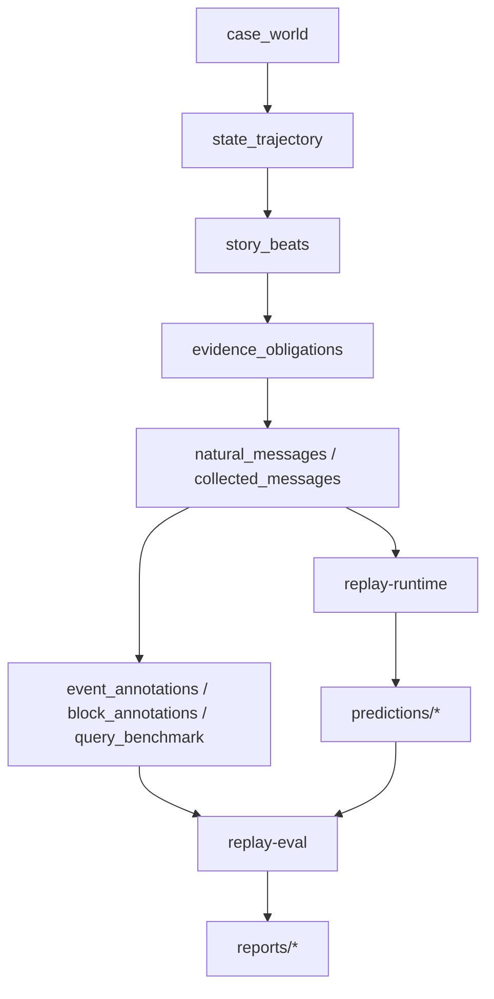

# 2026-05-06 Task Wiki 评测与 Golden 设计

## 1. 当前问题

当前 `feishu_builder_agent` 已经有：

```text
target-gold
-> gold
-> validate
```

但当前这套设计仍然存在一个根问题：

```text
builder 仍在生成 runtime-like gold。
```

也就是说，当前 `gold/expected_events.jsonl`、`gold/expected_memory_blocks.json`、`gold/expected_current_state.json` 更像是：

```text
builder 根据 target_state + collected_messages
合成出来的一组“看起来像 runtime 输出”的参考快照，
而不是独立于 runtime 实现之外的 annotation gold。
```

这会导致几个直接问题：

1. builder 生成的 gold 与 runtime extractor / projector 的字段形态过于相似，容易形成评测泄漏
2. `expected_events` 很容易被误解为 `session_events.jsonl` 的离线金标准换皮
3. `expected_memory_blocks` 很容易被误解为 `projector.js` 输出的离线金标准换皮
4. validate 和 effect evaluation 的边界会混在一起
5. 如果后续继续拿 `expected_*` 做 exact match，评到的是 builder 自己的口径，而不是 Task Wiki 系统本身

因此这份文档要彻底改口径：

```text
builder 不生成 runtime gold；
builder 生成 case world、state trajectory、coverage spec 和 evidence-bound annotations。
runtime 在 replay 中生成 prediction；
evaluator 通过 evidence alignment、claim matching、slot/current-state matching 和 QA faithfulness 进行分层评测。
```

这句话是全文核心原则。

---

## 2. 核心原则

这份设计从一开始就固定以下边界。

### 2.1 Builder 生成什么

builder 只生成：

1. `case world`
2. `state trajectory`
3. `coverage spec`
4. `conversation plan`
5. `command plan`
6. `evidence-bound annotations`

### 2.2 Builder 不生成什么

builder 不生成：

1. runtime `session_event`
2. runtime `session_wiki_state`
3. runtime `task_wiki_state`
4. runtime `event_id`
5. runtime `block_id`
6. runtime `verification verdict`
7. projector 输出

### 2.3 Runtime 只能在哪个阶段运行

runtime extractor / projector 只能在：

```text
replay-runtime
```

阶段运行。

也就是说：

- `task-events/extractor.js`
- `task-events/session-ingest.js`
- `task-wiki/projector.js`

都不能参与 gold 生成。

### 2.4 Gold 不能复用哪些 runtime 语义

gold 不能复用：

1. runtime `event_id`
2. runtime `block_id`
3. runtime `verification.verdict`
4. runtime `session_events.jsonl` 结构
5. runtime `session_wiki_state.json`
6. runtime `task_index_state.json`
7. runtime `task_wiki_state.json`

gold 只能描述：

```text
哪段证据应该支持什么 atomic claim；
这个 claim 属于什么 topic / slot；
它应该被抽取、被验证通过、被拒绝，还是应该进入 needs_review。
```

### 2.5 评测总原则

评测必须分层：

1. evidence alignment
2. event claim matching
3. block / slot / current-state matching
4. QA answer / citation / faithfulness matching

不做单一 JSON exact match。

---

## 3. 新的整体生成与评测链路

新的主链应该是：

```text
case_world
-> state_trajectory
-> story_beats
-> evidence_obligations
-> natural_messages
-> evidence-bound annotation gold
-> replay runtime
-> evaluator
```

也可以画成：



这条链路里有一个硬边界：

```text
annotation gold 必须建立在 collected_messages 的真实 evidence_quote 上；
prediction 必须建立在 replay-runtime 的真实 extractor / projector 上。
```

---

## 4. 中间抽象分层

当前文档不能只谈 gold 文件，还必须把 builder 内部的中间抽象拆清楚。

### 4.1 `case_world`

`case_world` 是故事世界，不是 event JSON。

它负责描述：

1. 组织背景
2. 公司类型
3. 角色关系
4. 冲突轴
5. 隐藏约束
6. 外部压力
7. 业务目标
8. 最终目标状态

它回答的问题是：

```text
这个 case 发生在什么样的企业协作世界里？
为什么这些人会在这些 source 里反复讨论这个任务？
```

示例：

```json
{
  "case_id": "case_feishu_505160829_example",
  "task_id": "FEISHU-505160829",
  "title": "FEISHU-505160829 发布窗口协调",
  "company_context": {
    "company_type": "B2B SaaS 公司",
    "business_pressure": "客户已将能力排入内部计划",
    "external_pressure": "销售希望给出明确口径"
  },
  "conflict_axes": [
    "发布日期口径是否可以对外承诺",
    "迁移窗口和放行条件是否已经闭环",
    "管理层同步口径是否应与客户口径保持一致"
  ],
  "hidden_constraints": [
    "数据迁移窗口尚未最终确认",
    "高风险能力仍受安全评审约束"
  ],
  "final_goal_state": {
    "release_window": "条件式窗口，不对外承诺具体日期",
    "external_messaging": "只同步准备中和条件未闭环两个事实"
  }
}
```

### 4.2 `state_trajectory`

`state_trajectory` 是每个 topic 的状态变化路径，不是最终 event。

它负责描述：

1. 初始状态
2. 中间修正
3. 哪些旧事实会被 supersede / revise
4. 哪些状态最终成为 current state
5. 哪些 source 负责暴露这些状态
6. 哪些 source 负责修正这些状态

它回答的问题是：

```text
每个 topic 在整条协作链里是如何演进的？
哪些是旧状态，哪些是最终有效状态？
```

示例：

```json
{
  "case_id": "case_feishu_505160829_example",
  "topics": [
    {
      "topic_key": "release_window",
      "initial_state": "先按五月上旬内部推进",
      "transitions": [
        {
          "transition_id": "release_window_t1",
          "kind": "proposal",
          "state": "先按五月上旬内部推进",
          "exposed_by_sources": ["chat:main_chat"]
        },
        {
          "transition_id": "release_window_t2",
          "kind": "constraint_update",
          "state": "blocker 未清零，不能对外承诺具体日期",
          "exposed_by_sources": ["thread:launch_window_thread"],
          "supersedes": ["release_window_t1"]
        },
        {
          "transition_id": "release_window_t3",
          "kind": "final_current_state",
          "state": "条件式窗口，当前不作为客户承诺",
          "exposed_by_sources": ["chat:main_chat", "chat:customer_sync_chat"],
          "supersedes": ["release_window_t2"]
        }
      ],
      "final_current_state_transition_id": "release_window_t3"
    }
  ]
}
```

### 4.3 `story_beats`

`story_beats` 是剧情节拍，不是 event JSON。

它描述的是：

1. 哪个角色
2. 在哪个 source / session
3. 用什么动机
4. 推动了哪一次状态变化

它回答的问题是：

```text
为什么这条消息会在这个 source 出现？
它在整条状态演进里承担什么剧情作用？
```

示例：

```json
{
  "beat_id": "beat_009",
  "topic_key": "release_window",
  "source_session_ref": "thread:launch_window_thread",
  "speaker_ref": "dev_wang_fang",
  "goal": "把风险从代码问题转移到迁移窗口与放行条件",
  "drives_transition_ids": ["release_window_t2"],
  "style_hint": "研发侧补充、偏谨慎、非正式汇报口吻"
}
```

### 4.4 `evidence_obligations`

`evidence_obligations` 是证据义务，不是 runtime event instance。

它只描述：

```text
这个 beat 自然落地成消息以后，
应该有机会产生哪些可验证事实类型。
```

例如：

- `conclusion`
- `constraint`
- `objection`
- `status`
- `commitment`
- `time`
- `scope`

它是：

```text
event opportunity
```

不是：

```text
runtime event instance
```

示例：

```json
{
  "beat_id": "beat_009",
  "topic_key": "release_window",
  "source_session_ref": "thread:launch_window_thread",
  "required_event_opportunities": [
    {
      "event_type": "constraint_event",
      "why": "需要暴露 blocker 未清零不能对外承诺日期"
    },
    {
      "event_type": "time_event",
      "why": "需要让系统有机会感知窗口从明确目标转为条件式窗口"
    }
  ],
  "negative_expectations": [
    {
      "forbidden_event_type": "commitment_event",
      "why": "这条消息不是承诺，只是风险补充"
    }
  ]
}
```

### 4.5 `natural_messages`

`natural_messages` 是自然对话，不允许为了迎合 event schema 写成结构化摘要。

必须保证：

1. 符合人类聊天语气
2. 可以带模糊表达
3. 可以有上下文依赖
4. 可以有 no-event / distractor / acknowledgement / question-only turn

不能把消息直接写成：

```text
Constraint: 数据迁移窗口尚未确认。
Conclusion: 当前不能承诺发布日期。
```

因为这会把评测退化成 schema 模板识别。

### 4.6 `annotation gold`

`annotation gold` 必须建立在真实 `collected_messages` 上。

它的核心要求是：

```text
消息生成并 collect 完成以后，
再基于真实出现的 evidence_quote 标注 atomic claim、event_type、topic_key、slot、required_fields。
```

这里有一个必须明确写死的规则：

```text
supports_event_types、semantic_payload_template、turn_template
只能作为 event opportunity / evidence obligation；
不能直接变成 event_annotations。
```

换句话说：

```text
builder 不能把 plan 里的 supports_event_types 直接抄成 annotation gold。
```

annotation 必须回到：

- `collected_messages.jsonl`
- 真实 `message_id`
- 真实 `content_text`
- 真实 `evidence_quote`

---

## 5. Builder 生成什么，不能生成什么

### 5.1 Builder 生成什么

builder 的职责是生成：

1. `input/case_world.json`
2. `input/state_trajectory.json`
3. `input/coverage_spec.json`
4. `input/conversation_plan.json`
5. `input/command_plan.jsonl`
6. `data/collected_messages.jsonl`
7. `gold/event_annotations.jsonl`
8. `gold/block_annotations.json`
9. `gold/query_benchmark.json`
10. `checks/complexity_gate.json`
11. `checks/integrity_gate.json`
12. `checks/eval_manifest.json`

### 5.2 Builder 不能生成什么

builder 不能生成：

1. `predictions/candidate_events.jsonl`
2. `predictions/session_events.jsonl`
3. `predictions/session_wiki_state.json`
4. `predictions/task_index_state.json`
5. `predictions/task_wiki_state.json`
6. runtime `event_id`
7. runtime `block_id`
8. runtime `verification verdict`

### 5.3 为什么不能生成 runtime gold

原因很简单：

```text
如果 builder 直接生成 runtime 风格输出，
评测就会变成“builder 的模板与 runtime 的实现相似度”比较，
而不是“runtime 是否从真实消息中正确抽取事实并组织结构”。
```

---

## 6. `target_state.json` 职责拆分

当前 `target_state.json` 职责过重，不应继续承担万能 control plane。

新的设计里应拆成三个输入文件。

### 6.1 `input/case_world.json`

负责：

1. 背景
2. 角色
3. 冲突轴
4. 隐藏约束
5. 外部压力
6. 最终目标状态

### 6.2 `input/state_trajectory.json`

负责：

1. 每个 topic 的状态演进
2. 哪些事实会被 revision / supersession
3. 哪些事实是 final current state
4. 哪些 source 负责暴露这些状态
5. 哪些 source 负责修正这些状态

### 6.3 `input/coverage_spec.json`

负责：

1. 必须覆盖哪些 event family
2. 必须覆盖哪些 source / session 类型
3. 必须覆盖哪些 slot
4. 必须覆盖哪些 query 类型
5. 必须包含多少 no-event / distractor / ambiguous / context-only turns

示例：

```json
{
  "required_event_families": [
    "conclusion_event",
    "constraint_event",
    "status_event",
    "time_event",
    "objection_event"
  ],
  "required_source_types": ["chat", "thread"],
  "required_slots": ["conclusion", "constraint", "status", "time"],
  "required_query_types": [
    "current_state",
    "cross_source_revision",
    "blocker_or_risk",
    "citation_sensitive",
    "negative_or_unknown"
  ],
  "minimum_negative_turns": {
    "no_event": 3,
    "ambiguous": 2,
    "context_only": 2,
    "ordinary_ack": 2
  }
}
```

### 6.4 `target_state.json` 的过渡期处理

过渡期可以保留 `target_state.json` 兼容旧脚本，但必须降级为：

```text
legacy compatibility input
```

不能继续把它当万能 control plane。

后续任何新逻辑都应优先读：

- `case_world.json`
- `state_trajectory.json`
- `coverage_spec.json`

而不是继续堆字段到 `target_state.json`。

---

## 7. 正式 Gold 文件定义

正式 `gold/` 目录只保留：

```text
gold/event_annotations.jsonl
gold/block_annotations.json
gold/query_benchmark.json
```

### 7.1 `gold/event_annotations.jsonl`

这是 evidence-bound annotation，不是 runtime `session_event`。

每条 annotation 至少必须包含：

1. `event_gold_id`
2. `evidence_turn_id`
3. `evidence_message_id`
4. `source_session_ref`
5. `evidence_quote`
6. `event_type`
7. `atomic_claim`
8. `required_fields`
9. `topic_key`
10. `slot`
11. `should_extract`
12. `should_verify`
13. `lifecycle_hint`

正例示例：

```json
{
  "event_gold_id": "evt_gold_001",
  "evidence_turn_id": "step_004",
  "evidence_message_id": "om_x100b5095232be8a4c36072fde6deaa9",
  "source_session_ref": "chat:main_chat",
  "evidence_quote": "当前先按五月上旬作为内部目标推进，但还没有对外锁死具体发布日期。",
  "event_type": "conclusion_event",
  "atomic_claim": "当前先按五月上旬作为内部目标推进，但还没有对外锁死具体发布日期。",
  "required_fields": {
    "conclusion": "当前先按五月上旬作为内部目标推进，但还没有对外锁死具体发布日期。",
    "target": "发布时间口径"
  },
  "topic_key": "release_window",
  "slot": "conclusion",
  "should_extract": true,
  "should_verify": true,
  "lifecycle_hint": "active"
}
```

### 7.2 Negative annotation

对于不应抽取 event 的消息，也可以写入 annotation。

示例：

```json
{
  "event_gold_id": "neg_001",
  "evidence_turn_id": "step_017",
  "evidence_message_id": "om_xxx",
  "source_session_ref": "chat:main_chat",
  "evidence_quote": "我先看看",
  "should_extract": false,
  "negative_reason": "vague_commitment",
  "forbidden_event_types": ["commitment_event"]
}
```

这类 negative annotation 用来评：

1. false positive rate
2. unsupported extraction rate
3. no-event stability
4. vague commitment 是否被误抽为 commitment

### 7.3 `gold/block_annotations.json`

这是 Block / Slot / Current State 的 gold，不是 runtime `session_wiki_state`。

建议结构：

```json
{
  "case_id": "case_feishu_505160829_example",
  "blocks": [
    {
      "topic_key": "release_window",
      "topic_title": "发布时间口径",
      "member_event_gold_ids": ["evt_gold_001", "evt_gold_002", "evt_gold_003"],
      "slot_gold_ids": {
        "conclusion": ["evt_gold_001"],
        "constraint": ["evt_gold_002"],
        "time": ["evt_gold_003"]
      },
      "current_gold_ids": {
        "conclusion": "evt_gold_001",
        "constraint": "evt_gold_002",
        "time": "evt_gold_003"
      },
      "stale_gold_ids": ["evt_gold_000"],
      "expected_status": "open"
    }
  ]
}
```

注意：

1. 不保存 runtime `block_id`
2. 不要求与 runtime topic title 完全同名
3. 只描述事件归组、slot 分配、current state、stale state、block status

### 7.4 `gold/query_benchmark.json`

这是 QA / Retrieval 层 gold。

每个 query 至少包含：

1. `query_id`
2. `question`
3. `query_type`
4. `expected_topics`
5. `required_event_gold_ids`
6. `required_block_topics`
7. `expected_answer_points`
8. `forbidden_claims`
9. `required_citation_level`
10. `stale_answer_check`

示例：

```json
{
  "case_id": "case_feishu_505160829_example",
  "queries": [
    {
      "query_id": "q_001",
      "question": "现在对外是否已经锁定发布日期？",
      "query_type": "current_state",
      "expected_topics": ["release_window", "external_messaging"],
      "required_event_gold_ids": ["evt_gold_010"],
      "required_block_topics": ["release_window"],
      "expected_answer_points": [
        "当前没有对外锁死具体发布日期",
        "当前口径是条件式窗口"
      ],
      "forbidden_claims": [
        "已经对客户承诺五月上旬上线"
      ],
      "required_citation_level": "event",
      "stale_answer_check": true
    }
  ]
}
```

### 7.5 明确禁止

必须在文档里明确写死：

```text
gold 不保存 runtime event_id；
gold 不保存 runtime block_id；
gold 不保存 runtime verification verdict；
gold 不直接等价于 session_events.jsonl。
```

---

## 8. `supports_event_types` 不能直接变成 annotation

这是实现里最容易出错的一点，所以单独拿出来强调。

### 8.1 可以保留什么

在 `conversation_plan` / `story_beats` 阶段可以保留：

- `supports_event_types`
- `semantic_payload_template`
- `turn_template`

因为它们仍然有用，可以帮助控制：

1. 剧情覆盖度
2. event opportunity 覆盖度
3. source / role / topic 的分布

### 8.2 不能直接做什么

但它们不能直接变成：

- `event_annotations.jsonl`
- `block_annotations.json`

原因是：

```text
supports_event_types 只说明“这条消息应该有机会表达哪类事实”，
并不说明 runtime 一定能从真实文本中抽到一个合格 event。
```

例如：

- 句子可能太含糊
- 证据可能不足
- 事实可能只有 context，不能作为 core evidence
- 消息可能天然应该进入 `needs_review`
- 消息可能根本不应被抽取

因此：

```text
supports_event_types 只能作为 evidence obligation，
不能作为 annotation gold。
```

---

## 9. Checks 不是 Gold

后续不要再使用“check golden”这个说法。

`checks/` 目录里的文件不是 gold，而是：

```text
deterministic quality gate / eval spec
```

正式命名改成：

```text
checks/complexity_gate.json
checks/integrity_gate.json
checks/eval_manifest.json
```

### 9.1 `checks/complexity_gate.json`

它规定最低复杂度要求，例如：

1. session 数
2. source session 数
3. message 数
4. thread depth
5. topic 数
6. state transition 数
7. cross-source revision 数
8. no-event turns 比例
9. distractor turns 比例

示例：

```json
{
  "minimum_sessions": 5,
  "minimum_source_sessions": 4,
  "minimum_messages": 28,
  "minimum_thread_depth": 5,
  "minimum_topics": 5,
  "minimum_state_transitions": 6,
  "minimum_cross_source_revisions": 2,
  "minimum_negative_turns": {
    "no_event": 3,
    "context_only": 2,
    "ambiguous": 2
  }
}
```

### 9.2 `checks/integrity_gate.json`

它规定：

1. `command_plan`
2. `collected_messages`
3. `actor_registry`
4. `event_annotations`

之间的结构一致性要求。

例如：

1. 每个 `evidence_turn_id` 必须存在
2. 每个 `evidence_message_id` 必须存在
3. `source_session_ref` 必须能在 plan 中找到
4. query benchmark 和 block annotation 只能引用已知 `event_gold_id`
5. annotation gold 不允许引用 collect 中不存在的 quote

### 9.3 `checks/eval_manifest.json`

它规定 replay-eval 应该跑哪些层、哪些 topic / slot / query 是 hard gate、哪些 metrics 只是观察项。

示例：

```json
{
  "required_layers": ["event", "block", "qa"],
  "hard_gate_topics": ["release_window", "readiness_blockers"],
  "hard_gate_slots": ["conclusion", "constraint", "status"],
  "hard_gate_query_types": ["current_state", "cross_source_revision"],
  "hard_metrics": {
    "event.verified_recall": 0.9,
    "event.no_event_false_positive_rate": 0.1,
    "qa.stale_answer_rate": 0.05
  },
  "observability_metrics": [
    "event.partial_alignment_rate",
    "block.block_status_accuracy",
    "qa.answer_point_recall"
  ]
}
```

---

## 10. No-event / Distractor 数据设计

每个 case 不能全是高密度 event 消息。

如果每条消息都承载清晰结构化事实，系统靠“每条都抽”也能拿到看起来不错的分数，这不是真实评测。

因此每个 case 必须包含一定比例的：

1. `no-event turns`
2. `ambiguous turns`
3. `context-only turns`
4. `duplicate turns`
5. `stale turns`
6. `weak commitment turns`
7. `ordinary acknowledgement turns`
8. `question-only turns`

### 10.1 这些 turn 的作用

这些消息用于评估：

1. false positive rate
2. unsupported extraction rate
3. `needs_review` / `rejected` 判断
4. no-op stability
5. stale current state 识别

### 10.2 例子

`ordinary acknowledgement`：

```text
收到，我先看看。
```

这类消息通常不应被抽成正式 event。

`context-only`：

```text
和上面一样，先别对外说死。
```

这类消息可能帮助 disambiguation，但如果没有足够 core evidence，不应该独立成为 verified event。

`question-only`：

```text
那本周能不能给客户一个时间窗口？
```

它可以触发后续回答，但本身通常不是 conclusion / commitment。

`duplicate turn`：

```text
再确认一下，当前还是不能对外承诺日期，对吧？
```

如果只是重复已有状态，不应被误判为新的 current state。

---

## 11. Candidate / Needs Review / Rejected 的评测

当前文档不能只评 verified event，还必须评 verification quality。

### 11.1 必须评的问题

至少要评估：

1. 应该 `verified` 的是否进入 `session_events`
2. 应该 `rejected` 的是否没有进入 `session_events`
3. 应该 `needs_review` 的是否被错误 `verified`
4. context-only 信息是否被错误抽取
5. 证据不足信息是否被错误抽取
6. 含糊承诺是否被错误当成 `commitment_event`

### 11.2 建议指标

新增这些指标：

1. `verified_recall`
2. `verified_precision`
3. `false_verified_rate`
4. `needs_review_accuracy`
5. `rejected_precision`
6. `no_event_false_positive_rate`
7. `unsupported_claim_rate`
8. `context_only_generation_rate`

### 11.3 Annotation 如何支持这层评测

`event_annotations.jsonl` 需要允许表达：

1. `should_extract = true / false`
2. `should_verify = true / false`
3. `review_reason`
4. `negative_reason`

例如一个 `needs_review` 场景：

```json
{
  "event_gold_id": "evt_review_001",
  "evidence_turn_id": "step_021",
  "evidence_message_id": "om_xx21",
  "source_session_ref": "chat:main_chat",
  "evidence_quote": "我这边可以先盯一下这个事情。",
  "event_type": "commitment_event",
  "atomic_claim": "说话人表达了弱承诺，但 owner/action 粒度不足。",
  "required_fields": {
    "action": "先盯一下这个事情"
  },
  "topic_key": "risk_controls",
  "slot": "commitment",
  "should_extract": true,
  "should_verify": false,
  "review_reason": "weak_commitment_missing_owner_or_deadline",
  "lifecycle_hint": "active"
}
```

这样 evaluator 才能判断：

```text
runtime 是否把本应 needs_review 的东西错误地写进了 verified session_events。
```

---

## 12. Runtime Prediction 从哪里来

Prediction 只能来自 replay runtime。

### 12.1 Replay-runtime 的输入

输入必须是：

- `data/openclaw_message_ingress.jsonl`
- runtime 所需最小 task binding / source metadata

### 12.2 Replay-runtime 的执行

必须真实运行：

1. `extensions/feishu-task-wiki/openclaw-lark/src/task-events/session-ingest.js`
2. `extensions/feishu-task-wiki/openclaw-lark/src/task-events/extractor.js`
3. `extensions/feishu-task-wiki/openclaw-lark/src/task-wiki/projector.js`

### 12.3 Replay-runtime 的输出

输出写入：

```text
predictions/candidate_events.jsonl
predictions/session_events.jsonl
predictions/session_wiki_state.json
predictions/task_index_state.json
predictions/task_wiki_state.json
```

### 12.4 Builder 不能参与 prediction 生成

builder 不能：

1. 模拟 runtime verdict
2. 预先写 prediction 文件
3. 根据 annotation gold 倒推 runtime output

---

## 13. Event Alignment 工程规则

当前文档不能只说“不做 event_id exact match”，还必须把 alignment 规则写落地。

新增输出文件：

```text
reports/event_alignment.json
```

### 13.1 `event_alignment.json` 结构

它用于保存 gold event 与 predicted event 的对齐关系。

每条记录至少包含：

1. `gold_event_id`
2. `predicted_event_id`
3. `alignment_status`
4. `evidence_match`
5. `event_type_match`
6. `claim_match_score`
7. `required_field_score`
8. `notes`

示例：

```json
{
  "gold_event_id": "evt_gold_010",
  "predicted_event_id": "evt_86b5ac49f8dccfb1",
  "alignment_status": "partial",
  "evidence_match": true,
  "event_type_match": true,
  "claim_match_score": 0.86,
  "required_field_score": 0.5,
  "notes": "时间口径对齐，但 target 正常化后仍缺少条件式窗口语义。"
}
```

### 13.2 对齐优先级

Event 层 matching 规则如下：

1. 优先用 `evidence_message_id` 对齐
2. 再比 `event_type`
3. 再比 `atomic_claim` 的语义等价
4. 再比 `required_fields`

明确不要求：

1. `event_id` 相等
2. `claim` 字面完全一致

### 13.3 时间表达归一化

时间表达必须 normalizer 之后再比较。

例如：

- `5月上旬`
- `五月上旬`
- `5 月上旬`

应视为等价。

### 13.4 Alignment Status

`alignment_status` 至少包含：

1. `exact`
2. `partial`
3. `unmatched`
4. `over_merged`
5. `over_split`

定义：

- `exact`
  - evidence、event_type、claim、required_fields 都高度一致
- `partial`
  - evidence 对齐，但 claim 或字段不完整
- `unmatched`
  - 没找到合理 prediction
- `over_split`
  - 一个 gold event 被 runtime 拆成多个 prediction
- `over_merged`
  - 多个 gold event 被 runtime 合成一个 prediction

### 13.5 Partial 不是全错

如果 evidence 对齐但字段缺失，不直接算全错。

应该：

1. 记为 `partial`
2. 在 `required_field_score` 上扣分
3. 在后续 event eval 中折算进 precision / completeness

---

## 14. Event 层评测

Event 层评测不是比较 `session_events.jsonl` 文件长得像不像。

它评的是：

```text
runtime 是否从真实消息中抽到了正确的 atomic fact，
并以合理的 verified / needs_review / rejected 边界落盘。
```

### 14.1 输入

Prediction：

- `predictions/candidate_events.jsonl`
- `predictions/session_events.jsonl`

Gold：

- `gold/event_annotations.jsonl`

Alignment：

- `reports/event_alignment.json`

### 14.2 核心指标

1. `verified_recall`
2. `verified_precision`
3. `false_verified_rate`
4. `needs_review_accuracy`
5. `rejected_precision`
6. `no_event_false_positive_rate`
7. `unsupported_claim_rate`
8. `context_only_generation_rate`
9. `required_field_completeness`
10. `claim_match_score_avg`

### 14.3 评测输出

建议写入：

```text
reports/event_eval.json
```

其中至少包含：

- overall metrics
- per-event-type metrics
- per-topic metrics
- high-severity error samples

---

## 15. Block / Current State 评测

Block / Current State 评测不能直接拿 `gold event_id` 和 `runtime event_id` 比。

必须先通过：

```text
reports/event_alignment.json
```

建立：

```text
gold_event_id -> predicted_event_id
```

映射。

### 15.1 Block 层必须依赖 Event Alignment

Block 层评测顺序必须是：

```text
先做 event alignment
-> 再做 block membership / slot / current-state comparison
```

不能跳过这一步。

### 15.2 Block 层输入

Prediction：

- `predictions/session_wiki_state.json`
- `predictions/task_index_state.json`
- `predictions/task_wiki_state.json`

Gold：

- `gold/block_annotations.json`

Alignment：

- `reports/event_alignment.json`

### 15.3 Block 层指标

1. `block_membership_pairwise_f1`
2. `slot_filling_accuracy`
3. `current_item_accuracy`
4. `stale_current_state_rate`
5. `cross_source_revision_hit_rate`
6. `supersession_accuracy`
7. `block_status_accuracy`

### 15.4 Block 层不要求什么

不要求：

1. `block_id` 字面相等
2. `topic_title` 字面相等

重点评的是：

1. 事件是否被组织到正确主题
2. slot 是否正确
3. 当前态是否正确
4. 旧状态是否被正确降级

### 15.5 输出

建议写入：

```text
reports/block_eval.json
```

---

## 16. QA / Retrieval 评测

QA 层不能只看 answer string 是否相似。

必须同时评：

1. hit
2. citation
3. faithfulness
4. stale answer
5. cross-source reasoning

### 16.1 `query_type`

`query_benchmark.json` 至少支持这些 `query_type`：

1. `current_state`
2. `cross_source_revision`
3. `blocker_or_risk`
4. `citation_sensitive`
5. `negative_or_unknown`
6. `commitment_lookup`
7. `timeline_lookup`

### 16.2 QA 指标

至少包含：

1. `hit_rate`
2. `answer_point_recall`
3. `citation_accuracy`
4. `faithfulness`
5. `unsupported_claim_rate`
6. `stale_answer_rate`
7. `forbidden_claim_rate`
8. `cross_source_reasoning_success_rate`

### 16.3 `stale_answer_rate` 必须单独强调

这是 Task Wiki 场景里的关键指标。

如果用户问的是：

```text
current state
```

但系统回答了旧口径，即使它引用了真实旧 evidence，也应该算错或严重扣分。

因为这里评的是：

```text
当前态是否正确
```

不是：

```text
是否能找到一条历史上真实存在的旧证据
```

### 16.4 输出

建议写入：

```text
reports/qa_eval.json
```

---

## 17. Data / Replay 完整性评测

这层不属于效果评测，而是数据质量与 replay 可执行性评测。

### 17.1 目标

目标是保证：

1. case 本身可评
2. replay 输入链完整
3. annotation gold 可追溯
4. hard gate 覆盖度达标

### 17.2 对应的 gate

这里主要读：

- `checks/complexity_gate.json`
- `checks/integrity_gate.json`

并输出 deterministic audit report。

### 17.3 Validate 的职责

`validate` 只做 deterministic audit，不跑 runtime。

它不能：

1. 运行 extractor
2. 运行 projector
3. 生成 prediction
4. 根据 prediction 反改 gold

---

## 18. Adapt 阶段边界

如果保留 `adapt` 阶段，必须明确它只能做什么，不能做什么。

### 18.1 Adapt 只能做什么

`adapt` 只能修复：

1. 数据完整性问题
2. 覆盖度不足问题
3. 格式错误
4. 缺失 source
5. 缺失 no-event turns
6. actor / ingress 字段不完整

### 18.2 Adapt 不能做什么

`adapt` 不能：

1. 根据 runtime prediction 修改 gold
2. 让 annotation gold 向 extractor / projector 输出靠拢
3. 修改 `evidence_quote` 来迎合 prediction
4. 重写 `atomic_claim` 只为让 alignment 更好看
5. 删除 negative sample 只为提升 precision

### 18.3 为什么要这样限制

因为一旦 `adapt` 能根据 prediction 反改 gold，评测就会泄漏。

必须保证：

```text
gold 由 evidence 和 control plane 决定，
不是由 runtime 表现决定。
```

---

## 19. 旧 Expected 文件降级为 Debug Artifact

旧文件不再放在 `gold/` 下。

改成：

```text
debug/expected_events.snapshot.jsonl
debug/expected_memory_blocks.snapshot.json
debug/expected_current_state.snapshot.json
```

它们的定位是：

```text
builder debug artifact / reference snapshot
```

不参与：

1. 正式 replay-eval
2. event alignment
3. evaluator 输入
4. hard gate 判断

换句话说：

```text
expected_* 只保留为过渡期参考快照，
不再是正式评测 gold。
```

---

## 20. 最终推荐目录结构

统一改成：

```text
input/
  case_world.json
  state_trajectory.json
  coverage_spec.json
  conversation_plan.json
  command_plan.jsonl

data/
  collected_messages.jsonl
  openclaw_message_ingress.jsonl

gold/
  event_annotations.jsonl
  block_annotations.json
  query_benchmark.json

checks/
  complexity_gate.json
  integrity_gate.json
  eval_manifest.json

predictions/
  candidate_events.jsonl
  session_events.jsonl
  session_wiki_state.json
  task_index_state.json
  task_wiki_state.json

reports/
  event_alignment.json
  event_eval.json
  block_eval.json
  qa_eval.json
  overall_eval.json

debug/
  expected_events.snapshot.jsonl
  expected_memory_blocks.snapshot.json
  expected_current_state.snapshot.json
```

### 20.1 目录语义

`input/`

- builder control plane

`data/`

- execute / collect / adapt 后的真实消息与 replay 输入

`gold/`

- annotation gold，不是 runtime output

`checks/`

- deterministic quality gate / eval spec，不是 gold

`predictions/`

- replay runtime 真实输出

`reports/`

- evaluator 产物

`debug/`

- 过渡期 snapshot，不参与正式评测

---

## 21. 最终阶段流程

流程统一改成：

```text
spec-generation
-> case-world
-> state-trajectory
-> characters
-> story-beats
-> conversation-plan
-> command-plan
-> execute
-> collect
-> annotation-gold
-> build-checks
-> validate
-> optional-adapt
-> replay-runtime
-> replay-eval
-> report
```

### 21.1 阶段职责

`spec-generation`

- 生成最小 case spec

`case-world`

- 生成组织背景、冲突轴、隐藏约束、角色关系、最终目标状态

`state-trajectory`

- 生成每个 topic 的状态演进

`characters`

- 生成角色画像与 simulated open_id 映射

`story-beats`

- 生成剧情节拍和 source / speaker / transition 关系

`conversation-plan`

- 生成多 session、多 source、多 turn 的会话计划

`command-plan`

- 生成可执行飞书动作

`execute`

- 真实执行动作

`collect`

- 拉取真实消息

`annotation-gold`

- 基于真实 collected messages 生成 evidence-bound annotation gold

`build-checks`

- 生成 deterministic quality gate / eval spec，不生成正确答案

`validate`

- 只做 deterministic audit，不跑 runtime

`optional-adapt`

- 只修数据完整性与覆盖问题，不改 gold 以迎合 prediction

`replay-runtime`

- 真实运行 runtime extractor / projector，生成 predictions

`replay-eval`

- 只能比较 gold annotations 和 runtime predictions

`report`

- 汇总 event / block / qa / overall 报告

### 21.2 顺序边界

必须明确：

1. `annotation-gold` 发生在 `collect` 之后
2. `replay-runtime` 发生在 `annotation-gold` 之后
3. `validate` 不跑 runtime
4. `build-checks` 不生成正确答案
5. `replay-eval` 只能比较 gold annotations 与 runtime predictions

---

## 22. 最终回答

这份设计最终明确回答 10 个问题。

### 22.1 Builder 到底生成什么

builder 生成：

1. `case_world`
2. `state_trajectory`
3. `coverage_spec`
4. `conversation_plan`
5. `command_plan`
6. `collected_messages`
7. `event_annotations`
8. `block_annotations`
9. `query_benchmark`
10. `complexity_gate`
11. `integrity_gate`
12. `eval_manifest`

### 22.2 Builder 不能生成什么

builder 不能生成：

1. runtime `session_event`
2. runtime `block_id`
3. runtime `event_id`
4. runtime `verification verdict`
5. projector 输出
6. prediction 文件

### 22.3 `case_world`、`state_trajectory`、`story_beats`、`event_annotations` 分别是什么

`case_world`

- 企业协作世界

`state_trajectory`

- 每个 topic 的状态演化路径

`story_beats`

- 哪个角色在哪个 source 推动了哪次状态变化

`event_annotations`

- 基于真实消息证据标注出的 evidence-bound atomic claim annotation

### 22.4 Event annotation 如何避免变成 `expected_events` 换皮

靠 4 条边界：

1. 不使用 runtime `event_id`
2. 不使用 runtime `verification verdict`
3. 不直接长成 `session_events.jsonl`
4. 必须从真实 `evidence_quote` 回标，而不是从 `supports_event_types` 直出

### 22.5 Runtime prediction 从哪里来

只能来自：

```text
replay-runtime
```

真实运行 `task-events` 与 `task-wiki`。

### 22.6 Event / Block / QA 三层如何对齐和打分

1. Event：先做 `event_alignment.json`
2. Block：基于 `event_alignment.json` 做 topic / slot / current-state matching
3. QA：基于 query benchmark 做 hit / citation / faithfulness / stale answer 评测

### 22.7 Negative / no-event / needs_review / rejected 如何评测

通过：

1. negative annotation
2. `should_extract`
3. `should_verify`
4. `review_reason`
5. verification quality metrics

来单独评测。

### 22.8 旧 expected 文件如何降级为 debug artifact

移动到：

```text
debug/expected_events.snapshot.jsonl
debug/expected_memory_blocks.snapshot.json
debug/expected_current_state.snapshot.json
```

不再作为正式 gold。

### 22.9 Adapt 阶段如何避免评测泄漏

规定：

1. adapt 只能修数据完整性与覆盖问题
2. adapt 不能根据 prediction 修改 gold
3. adapt 不能修改 quote / claim 去迎合 runtime

### 22.10 最终目录结构和 pipeline 是什么

目录结构见第 20 节，阶段流程见第 21 节。

---

## 23. 最终决策

最终采用下面这套固定口径：

```text
builder 不生成 runtime gold；
builder 生成 case world、state trajectory、coverage spec 和 evidence-bound annotations。
runtime 在 replay 中生成 prediction；
evaluator 通过 evidence alignment、claim matching、slot/current-state matching 和 QA faithfulness 进行分层评测。
```

这条原则必须贯穿：

1. case 生成
2. gold 生成
3. validate
4. replay-runtime
5. replay-eval
6. report

任何后续实现如果违反这条边界，都应视为评测设计退化。
