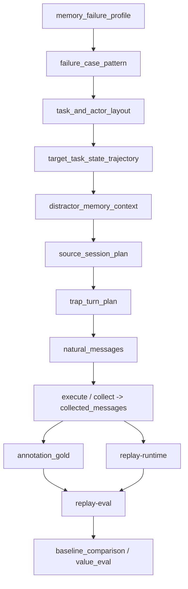

# 2026-05-06 Task Wiki 评测与 Golden 设计 V3

本文是 `Task Wiki 评测与 Golden 设计 V3`。  
V3 替代此前所有旧设计口径，不保留双轨方案，不保留过渡性主设计。后续 `builder`、`replay-runtime`、`evaluator`、`dataset` 结构均以本文为唯一规范。

## 1. 当前问题与 V3 目标

V3 要同时解决两个问题。

### 1.1 旧方案的问题

旧方案把 builder 推向了 `runtime-like gold`：

```text
builder 产出 expected_events / expected_memory_blocks / expected_current_state
-> evaluator 拿它们去对 runtime 做近似 exact match
```

这会带来三个直接问题：

1. builder 生成的“正确答案”与 runtime 输出过于相似，存在评测泄漏。
2. `expected_events` 很容易退化成 `session_events.jsonl` 的离线换皮。
3. 评测结果更像在比较 builder 模板与 runtime 模板，而不是比较系统是否真的记住了任务。

### 1.2 旧方案没有回答的关键问题

旧方案没有回答最重要的问题：

```text
如何生成一批会让 OpenClaw 当前 Memory.md 失败、但 Task Wiki 能成功的数据？
```

V3 的答案不是“先造复杂故事，再补评测点”，而是：

```text
先选择 Memory.md failure mode，
再倒推任务、人员、source、状态变化、干扰上下文、trap turn 和 probe query。
```

### 1.3 V3 的目标

V3 的主 baseline 是 OpenClaw 当前 `Memory.md`。  
普通 `raw-message RAG` 是辅助 baseline，不是主叙事。

V3 的 benchmark 目标不是“复杂”，而是：

```text
稳定暴露 baseline failure，
并证明 Task Wiki 为什么能在同类 case 上更准、更可追溯、更能维护 current state。
```

V3 的唯一主口径如下：

```text
builder 不生成 runtime gold；
builder 生成 case world、state trajectory、coverage spec、conversation plan 和 evidence-bound annotations。
runtime 在 replay 中生成 prediction；
evaluator 通过 evidence alignment、claim matching、slot/current-state matching、QA faithfulness 和 baseline comparison 进行分层评测。
```

## 2. V3 核心原则

### 2.1 Builder 生成什么

builder 只生成：

1. `case_world`
2. `state_trajectory`
3. `coverage_spec`
4. `conversation_plan`
5. `command_plan`
6. `evidence-bound annotations`
7. `checks`

### 2.2 Builder 不生成什么

builder 不生成：

1. runtime `session_event`
2. runtime `session_wiki_state`
3. runtime `task_index_state`
4. runtime `task_wiki_state`
5. runtime `event_id`
6. runtime `block_id`
7. runtime `verification verdict`
8. projector 输出

### 2.3 Runtime 只能在哪个阶段运行

runtime extractor / projector 只能在：

```text
replay-runtime
```

阶段运行。

也就是说：

- `task-events/session-ingest`
- `task-events/extractor`
- `task-wiki/projector`

都不能参与 gold 生成。

### 2.4 Gold 不能复用哪些 runtime 语义

gold 不能复用：

1. runtime `event_id`
2. runtime `block_id`
3. runtime `verification verdict`
4. runtime `session_events.jsonl` 结构
5. runtime `session_wiki_state.json`
6. runtime `task_index_state.json`
7. runtime `task_wiki_state.json`

gold 只能描述：

```text
哪段证据支持什么 atomic claim；
这个 claim 属于什么 topic / slot；
它应该被抽取、进入 verified、进入 needs_review、进入 rejected，还是根本不应形成 event。
```

### 2.5 评测总原则

评测必须分层：

1. evidence alignment
2. event claim matching
3. block / slot / current-state matching
4. QA answer / citation / faithfulness matching
5. baseline comparison / value evaluation

不做单一 JSON exact match。

## 3. OpenClaw Fail 数据生成方法

V3 的主变化不是补一个 schema，而是把 case generation 的上游控制面改成：

```text
OpenClaw Memory.md failure-oriented case generation
```

### 3.1 为什么必须改成 failure-oriented

如果先写故事，再看覆盖了哪些 event family，得到的通常只是：

```text
复杂、热闹、消息很多
```

但这不等于：

```text
能稳定复现 Memory.md 的失败模式
```

V3 的原则是：

```text
先定义 baseline 会掉进去的坑，
再围绕这个坑构造世界、轨迹、消息与查询。
```

### 3.2 V3 的 trap-first 生成链路

```text
memory_failure_profile
-> failure_case_pattern
-> task_and_actor_layout
-> target_task_state_trajectory
-> distractor_memory_context
-> source_session_plan
-> trap_turn_plan
-> natural_messages
-> memory_probe_queries
-> annotation_gold
-> baseline_comparison
```



### 3.3 四类固定 failure mode

V3 只保留四类 case family：

1. `personal_memory_pollution`
2. `unverifiable_summary_claim`
3. `static_memory_stale_state`
4. `dependency_propagation_failure`

其中：

- 前三类是核心必测 failure mode
- 第四类是增强型 hard mode

### 3.4 failure mode 与项目突破的映射

- `personal_memory_pollution`
  对应突破一：任务级记忆组织
- `unverifiable_summary_claim`
  对应突破二：证据驱动的 Event 记忆
- `static_memory_stale_state`
  对应突破三：增量可更新的任务状态维护
- `dependency_propagation_failure`
  对应企业协作中的跨任务状态传播与检索价值

### 3.5 Failure Mode 1：`personal_memory_pollution`

`Memory.md` 应该怎么失败：

```text
把多个任务、多个角色、多个状态时间点混写，
导致用户问 target task 时答进无关任务，或把旧负责人 / 其他审批状态混进来。
```

Case pattern：

```text
Personal Memory Pollution Pattern
```

生成规则：

1. 每个 case 至少 1 个 target task、2 到 3 个 distractor tasks、3 到 5 个 shared actors。
2. 多任务共享负责人、审批状态、截止时间、依赖、blocker 等相似字段。
3. target task 与 distractor task 至少共享 2 类同名 slot。
4. 至少 1 个 query 专门问 target task 的 current owner / blocker / approval status。

case 必带字段示例：

```json
{
  "failure_case_pattern": "personal_memory_pollution",
  "target_task_id": "FEISHU-231",
  "distractor_tasks": ["PROD-123", "FEISHU-312", "FEISHU-291"],
  "shared_actors": ["Alice", "Bob", "Carol", "xzy"],
  "overlapping_slots": ["owner", "approval_status", "blocker", "deadline"]
}
```

预期 OpenClaw failure：

1. 回答包含无关任务信息。
2. 把别的任务的审批状态混进 target task。
3. 把历史 owner 或 distractor owner 当 current owner。

预期 Task Wiki success：

1. 以 `task_id` 组织记忆。
2. answer 只引用 target task 相关 event / block。
3. 能把 distractor 信息排除在 citation 之外。

probe query 示例：

```text
只看 FEISHU-231，当前负责人是谁？当前阻塞是什么？
```

对应 metrics：

- `task_memory_isolation_accuracy`
- `irrelevant_memory_pollution_rate`
- `current_item_accuracy`
- `citation_accuracy`

### 3.6 Failure Mode 2：`unverifiable_summary_claim`

`Memory.md` 应该怎么失败：

```text
写出一个看起来合理的总结，
但这条总结没有证据，或者把猜测、转述、弱承诺写成确定事实。
```

Case pattern：

```text
Unverifiable Summary Claim Pattern
```

生成规则：

1. 同一 topic 下同时生成 verified fact、ambiguous turn、hearsay turn、ordinary ack、context-only turn。
2. 至少一条弱承诺长得像 `commitment_event`，但不够进入 verified。
3. 至少一条普通确认长得像“已接手”，但实际上只是 acknowledgement。
4. 至少一个 query 专门问“谁说的 / 依据是什么 / 是否真的确定”。

case 必带字段示例：

```json
{
  "failure_case_pattern": "unverifiable_summary_claim",
  "target_claim": "FEISHU-231 当前受财务问题阻塞",
  "evidence_distribution": {
    "verified_fact_turns": 2,
    "ambiguous_turns": 2,
    "hearsay_turns": 1,
    "ordinary_ack_turns": 2,
    "context_only_turns": 1
  }
}
```

预期 OpenClaw failure：

1. 把模糊表达写成确定记忆。
2. claim 无法回到原文 quote。
3. 无法区分 verified fact 与 hearsay / weak signal。

预期 Task Wiki success：

1. verified event 必须绑定 `evidence_quote`。
2. 模糊表达进入 `needs_review` 或 `rejected`。
3. ordinary ack / no-event 不进入正式事实层。

probe query 示例：

```text
现在说“财务问题阻塞上线”这件事，具体是谁明确说的？有没有直接证据？
```

对应 metrics：

- `unsupported_claim_rate`
- `verified_precision`
- `needs_review_accuracy`
- `no_event_false_positive_rate`

### 3.7 Failure Mode 3：`static_memory_stale_state`

`Memory.md` 应该怎么失败：

```text
同一任务状态持续变化，
旧状态虽然曾经真实，但已经不是 current state；
Memory.md 容易继续把旧状态当成当前态。
```

Case pattern：

```text
Static Memory Stale State Pattern
```

生成规则：

1. 每个关键 topic 至少三段状态：initial、intermediate、final。
2. 至少覆盖 `owner`、`deadline`、`blocker` 三类 track 中的两类。
3. 至少 1 次 cross-source revision。
4. 至少 1 个 query 专门问 current state，检查 stale answer。

case 必带字段示例：

```json
{
  "failure_case_pattern": "static_memory_stale_state",
  "state_tracks": [
    {
      "track_key": "owner",
      "states": ["Bob", "Alice", "xzy"],
      "final_current_state": "xzy",
      "stale_states": ["Bob", "Alice"]
    },
    {
      "track_key": "deadline",
      "states": ["2026-04-24", "2026-04-28"],
      "final_current_state": "2026-04-28",
      "stale_states": ["2026-04-24"]
    }
  ]
}
```

预期 OpenClaw failure：

1. 把旧负责人或旧截止时间当 current state。
2. 无法稳定区分历史状态与当前状态。
3. 后续新增 session 后，旧状态继续污染回答。

预期 Task Wiki success：

1. current slot 指向最新状态。
2. stale 状态保留为历史，不作为当前答案。
3. supersession 与 cross-source revision 可追溯。

probe query 示例：

```text
现在 FEISHU-231 的当前负责人到底是谁？不是历史负责人，是当前口径。
```

对应 metrics：

- `current_state_accuracy`
- `stale_answer_rate`
- `supersession_accuracy`
- `cross_source_revision_hit_rate`

### 3.8 Failure Mode 4：`dependency_propagation_failure`

`Memory.md` 应该怎么失败：

```text
能记住局部事实，
但不能稳定回答“上游没过会影响哪些下游任务、当前还能不能继续推进”。
```

Case pattern：

```text
Dependency Propagation Failure Pattern
```

生成规则：

1. target task 与上游审批、下游发布、关联任务之间必须存在显式依赖。
2. 至少 1 次“局部状态已更新，但依赖后果未同步说明”的消息轨迹。
3. 至少 1 个 query 问依赖传播结果，而不是只问单条事实。

case 必带字段示例：

```json
{
  "failure_case_pattern": "dependency_propagation_failure",
  "dependency_path": [
    "legal_approval -> finance_clearance -> release_window -> customer_commitment"
  ],
  "blocking_edge": "finance_clearance -> release_window"
}
```

预期 OpenClaw failure：

1. 只能答局部状态，答不出依赖传播后的 current implication。
2. 把上游旧状态与下游当前状态混在一起。

预期 Task Wiki success：

1. 通过 task wiki / index / dependency block 回答跨 source 推理问题。
2. 明确引用当前 blocker 与其影响范围。

probe query 示例：

```text
如果财务还没过，当前还能不能对客户承诺五月上旬上线？为什么？
```

对应 metrics：

- `cross_source_reasoning_success_rate`
- `blocker_or_risk_hit_rate`
- `decision_consistency_rate`

## 4. 中间抽象分层

V3 不推翻已有中间抽象，但每一层都必须显式承载 failure intent。

### 4.1 `case_world`

`case_world` 是故事世界，不是 event JSON。

它至少负责：

1. 企业背景
2. 角色关系
3. 冲突轴
4. 隐藏约束
5. 外部压力
6. 最终目标状态
7. `case_generation_goal`
8. `memory_failure_profile`
9. `task_and_actor_layout`
10. `distractor_memory_context`

示例：

```json
{
  "case_id": "case_feishu_505160829_example",
  "task_id": "FEISHU-505160829",
  "case_generation_goal": {
    "baseline": "openclaw_memory_md",
    "goal": "生成会暴露 Memory.md stale state 与 evidence weakness 的企业任务记忆 case"
  },
  "memory_failure_profile": {
    "selected_failure_modes": [
      "static_memory_stale_state",
      "unverifiable_summary_claim"
    ],
    "primary_failure_mode": "static_memory_stale_state"
  },
  "task_and_actor_layout": {
    "target_task_id": "FEISHU-505160829",
    "shared_actors": ["Alice", "Bob", "Carol", "xzy"]
  },
  "distractor_memory_context": {
    "distractor_tasks": ["PROD-123", "FEISHU-312"]
  }
}
```

### 4.2 `state_trajectory`

`state_trajectory` 是每个 topic 的状态变化路径，不是最终 event。

它至少负责：

1. `target_task_state_trajectory`
2. `revision_points`
3. `supersession_edges`
4. `final_current_state`
5. `dependency_path`
6. 哪些 source 暴露旧状态
7. 哪些 source 修正旧状态

### 4.3 `coverage_spec`

`coverage_spec` 不是剧情，也不是 gold。

它负责规定这条 case 在评测层面必须覆盖什么：

1. 必须覆盖哪些 `failure_mode`
2. 必须覆盖哪些 `event family`
3. 必须覆盖哪些 `source/session`
4. 必须覆盖哪些 `slot`
5. 必须覆盖哪些 `query_type`
6. 必须包含多少 `no-event / ambiguous / distractor / context-only` turns
7. 哪些 failure mode / topic / query 是 hard gate

它的作用是防止 case 漂成“故事上很热闹，但 benchmark 上没有杀伤力”。

### 4.4 `story_beats`

`story_beats` 是剧情节拍，不是 event JSON。

V3 中每个 beat 不只要说明“谁在什么 source 推动了什么变化”，还要说明：

1. `memory_failure_mode`
2. 哪个 beat 是 `baseline trap`
3. 哪个 beat 是 `revision beat`
4. 哪个 beat 是 `distractor beat`

### 4.5 `evidence_obligations`

`evidence_obligations` 是证据义务，不是 runtime event instance。

它除了定义 event opportunity，还必须定义：

1. 哪些 obligation 目标是 `verified`
2. 哪些 obligation 目标是 `needs_review`
3. 哪些 obligation 目标是 `no_event`
4. 哪些 obligation 本身就是 `false-positive trap`

这里还要加一条硬边界：

```text
supports_event_types、semantic_payload_template、turn_template
只能作为 event opportunity / plan metadata；
不能直接变成 event_annotations。
```

因为它们描述的是“这条消息应该有机会表达什么”，不是“runtime 一定抽出了一个合格 event”。

### 4.6 `natural_messages` 与 `collected_messages`

这里的边界必须写死：

```text
natural_messages 属于 plan-time generation，用于指导 execute；
collected_messages 属于 execution-time observation，是 collect 阶段采集到的真实消息。
```

因此：

```text
annotation 只能引用 collected_messages 中的 evidence_message_id 和 evidence_quote；
不能引用 conversation_plan / natural_messages draft 中的文本生成 gold。
```

## 5. Builder、Observed Data 与 Conversation Plan

### 5.1 Builder 生成什么

builder 生成：

1. `input/case_world.json`
2. `input/state_trajectory.json`
3. `input/coverage_spec.json`
4. `input/conversation_plan.json`
5. `input/command_plan.jsonl`
6. `gold/event_annotations.jsonl`
7. `gold/block_annotations.json`
8. `gold/query_benchmark.json`
9. `checks/complexity_gate.json`
10. `checks/integrity_gate.json`
11. `checks/eval_manifest.json`

### 5.2 `collected_messages` 不是 builder 的答案文件

必须明确：

```text
builder 生成 command_plan；
execute 真实执行动作；
collect 从飞书或模拟环境采集真实消息；
collected_messages 是 collect 阶段的 observed data，不是 builder 直接生成的 gold。
```

annotation gold 必须基于 `collected_messages` 回标，不能基于 plan-time draft message 回标。

### 5.3 `conversation_plan` 必须承载 trap 设计

V3 中 `conversation_plan.json` 不能只是对话草图。

每个 planned turn 至少包含：

1. `benchmark_role`
2. `memory_failure_mode`
3. `memory_trap`
4. `expected_openclaw_memory_risk`
5. `task_wiki_expected_handling`

推荐固定 `benchmark_role`：

1. `baseline_trap_turn`
2. `revision_turn`
3. `ambiguous_turn`
4. `negative_turn`
5. `cross_source_correction_turn`
6. `dependency_exposure_turn`

示例：

```json
{
  "turn_id": "step_017",
  "source_session_ref": "chat:main_chat",
  "benchmark_role": "baseline_trap_turn",
  "memory_failure_mode": "static_memory_stale_state",
  "memory_trap": "这条早期消息会让 Memory.md 记录 Bob 为负责人，但后续会被 Alice 和 xzy 覆盖。",
  "expected_openclaw_memory_risk": "Memory.md 可能无法区分 Bob 是历史负责人还是当前负责人。",
  "task_wiki_expected_handling": "保留为历史 event，后续 current owner 被 supersede。"
}
```

这些字段属于 plan-time metadata：

1. 不属于 runtime
2. 不直接变成 annotation
3. 只能作为后续回标与 error analysis 的控制面

## 6. Gold 文件定义

正式 `gold/` 目录只保留：

```text
gold/event_annotations.jsonl
gold/block_annotations.json
gold/query_benchmark.json
```

### 6.1 `gold/event_annotations.jsonl`

这是 evidence-bound annotation，不是 runtime `session_event`。

为统一 positive / negative / review 三类记录，必须显式包含：

1. `annotation_kind`
2. `expected_verdict`

`annotation_kind` 固定支持：

1. `positive_event`
2. `negative_no_event`
3. `review_event`

`expected_verdict` 固定支持：

1. `verified`
2. `needs_review`
3. `rejected`
4. `no_event`

`positive_event` 至少包含：

1. `event_gold_id`
2. `evidence_turn_id`
3. `evidence_message_id`
4. `source_session_ref`
5. `evidence_quote`
6. `event_type`
7. `atomic_claim`
8. `required_fields`
9. `topic_key`
10. `slot`
11. `should_extract`
12. `expected_verdict`
13. `lifecycle_hint`

`negative_no_event` 要求：

1. `event_type = null`
2. `atomic_claim = null`
3. `required_fields = {}`
4. `slot = null`
5. `should_extract = false`
6. `expected_verdict = "no_event"`

`review_event` 用来表达：

```text
runtime 可以生成 candidate，
但不能直接进入 verified session_events。
```

### 6.2 `gold/block_annotations.json`

这是 Block / Slot / Current State 的 gold，不是 runtime `session_wiki_state`。

它只描述：

1. 哪些 `event_gold_id` 属于同一 topic
2. 它们应该落到哪些 slot
3. 哪些是 `current`
4. 哪些是 `stale`
5. block 的预期状态

不保存 runtime `block_id`。

### 6.3 `gold/query_benchmark.json`

V3 中 query benchmark 不只是 QA 数据，而是 baseline-break 数据。

每个 query 至少包含：

1. `query_id`
2. `question`
3. `query_type`
4. `expected_topics`
5. `required_event_gold_ids`
6. `required_block_topics`
7. `expected_answer_points`
8. `forbidden_claims`
9. `required_citation_level`
10. `stale_answer_check`
11. `source_trap_id`
12. `failure_mode`
13. `expected_openclaw_failure`

query 分为两类：

1. `system-correctness queries`
2. `baseline-break queries`

必须明确：

1. 每个 `memory_trap` 至少派生一个 query
2. 每个核心 failure mode 至少有 2 到 3 个 probe query
3. query 目标不是泛泛提问，而是把 `Memory.md` 的典型错误逼出来

### 6.4 明确禁止

V3 里必须写死：

```text
gold 不保存 runtime event_id；
gold 不保存 runtime block_id；
gold 不保存 runtime verification verdict；
gold 不直接等价于 session_events.jsonl。
```

## 7. Checks 不是 Gold

`checks/` 目录里的文件不是 gold，而是 deterministic quality gate / eval spec。

正式命名为：

```text
checks/complexity_gate.json
checks/integrity_gate.json
checks/eval_manifest.json
```

### 7.1 `checks/complexity_gate.json`

规定最小复杂度要求，例如：

1. session 数
2. source session 数
3. message 数
4. topic 数
5. state transition 数
6. cross-source revision 数
7. no-event turns 比例
8. distractor turns 比例
9. trap coverage

### 7.2 `checks/integrity_gate.json`

规定：

1. `command_plan`
2. `collected_messages`
3. `actor_registry`
4. `event_annotations`
5. `block_annotations`
6. `query_benchmark`

之间的结构一致性。

### 7.3 `checks/eval_manifest.json`

规定：

1. replay-eval 跑哪些 layer
2. 哪些 topic / slot / query 是 hard gate
3. 哪些 failure mode 是 hard requirement
4. 哪些 metrics 是 hard gate
5. 哪些 metrics 是观察项

## 8. Prediction 与 Verification 边界

### 8.1 Prediction 从哪里来

prediction 只能来自：

```text
replay-runtime
```

真实运行：

1. `task-events/session-ingest`
2. `task-events/extractor`
3. `task-wiki/projector`

### 8.2 Prediction 输出

输出写入：

```text
predictions/candidate_events.jsonl
predictions/session_events.jsonl
predictions/session_wiki_state.json
predictions/task_index_state.json
predictions/task_wiki_state.json
```

### 8.3 `candidate_events` / `session_events` 的唯一定义

V3 固定：

1. `session_events.jsonl` 只保存 verified
2. `candidate_events.jsonl` 承接 rejected / needs_review / 候选抽取
3. verification quality evaluation 必须同时读取两者

### 8.4 `no_event`、`rejected`、`needs_review`、`verified`

这里必须明确：

```text
no_event ≠ rejected
```

四者定义如下：

1. `no_event`
   - runtime 不应该生成任何 candidate
2. `rejected`
   - runtime 可以生成 candidate，但 verifier 应拒绝它进入 `session_events`
3. `needs_review`
   - runtime 可以生成 candidate，但不能进入 verified `session_events`
4. `verified`
   - runtime 应写入 `session_events`

## 9. Event Alignment 与分层评测

### 9.1 `reports/event_alignment.json`

Event 层不要求 `event_id` exact match。

新增输出：

```text
reports/event_alignment.json
```

每条记录至少包含：

1. `gold_event_id`
2. `predicted_event_id`
3. `predicted_candidate_event_id`
4. `predicted_verdict`
5. `alignment_status`
6. `evidence_match`
7. `event_type_match`
8. `claim_match_score`
9. `required_field_score`
10. `notes`

### 9.2 对齐规则

优先级固定为：

1. 先比 `evidence_message_id`
2. 再比 `event_type`
3. 再比 `atomic_claim` 语义等价
4. 再比 `required_fields`

时间表达先做 normalize，例如：

- `5月上旬`
- `五月上旬`
- `5 月上旬`

应视为等价。

### 9.3 多候选竞争规则

同一 message 可能抽出多个 event，因此：

1. 对每个 gold event，先筛选同 `evidence_message_id` 的 predicted candidates / predicted events
2. 计算综合匹配分

```text
alignment_score =
  evidence_score * 0.35
  + event_type_score * 0.25
  + claim_match_score * 0.25
  + required_field_score * 0.15
```

3. 在同一 `evidence_message_id` 内做 bipartite matching
4. 一个 predicted event 不能同时 exact match 多个 gold event
5. 一个 predicted event 覆盖多个 gold atomic claims，标记 `over_merged`
6. 多个 predicted events 共同覆盖一个 gold atomic claim，标记 `over_split`

### 9.4 Event 层指标

`reports/event_eval.json` 至少输出：

1. `verified_recall`
2. `verified_precision`
3. `false_verified_rate`
4. `needs_review_accuracy`
5. `rejected_decision_accuracy`
6. `no_event_false_positive_rate`
7. `unsupported_claim_rate`
8. `context_only_generation_rate`
9. `required_field_completeness`
10. `claim_match_score_avg`

并支持：

1. `overall`
2. `by_failure_mode`
3. `by_event_type`
4. `by_topic`

### 9.5 Block / Current State 层指标

Block 层必须依赖 `event_alignment.json`。

如果某个 gold event 在 Event 层 `unmatched`，那么它在 Block 层视为：

```text
unavailable
```

`reports/block_eval.json` 至少输出两套结果：

1. `block_eval_on_all_gold_events`
2. `block_eval_on_aligned_events_only`

Block 指标包括：

1. `block_membership_pairwise_f1`
2. `slot_filling_accuracy`
3. `current_item_accuracy`
4. `stale_current_state_rate`
5. `cross_source_revision_hit_rate`
6. `supersession_accuracy`
7. `block_status_accuracy`

并支持：

1. `overall`
2. `by_failure_mode`
3. `by_topic`

### 9.6 QA / Retrieval 层指标

QA evaluator 分为两类：

1. `deterministic check`
2. `semantic judge`

`deterministic check` 评：

1. `required_event_gold_ids` 是否被命中
2. `required_block_topics` 是否被命中
3. citation path 是否能回到 event / block / evidence quote
4. `forbidden_claims` 是否命中
5. current-state query 是否引用 stale transition
6. `negative_or_unknown` query 是否被编造

`semantic judge` 评：

1. `expected_answer_points` 是否覆盖
2. answer 是否 faithful to evidence
3. 是否出现 unsupported claim
4. 是否把旧状态当成当前状态
5. cross-source reasoning 是否成立

judge 输入至少包含：

1. `question`
2. `model answer`
3. `expected_answer_points`
4. `forbidden_claims`
5. `required_event_gold_ids`
6. `retrieved citations`
7. `evidence_quotes`
8. `current_state gold`
9. `stale_gold_ids`

`reports/qa_eval.json` 至少输出：

1. `hit_rate`
2. `answer_point_recall`
3. `citation_accuracy`
4. `faithfulness`
5. `unsupported_claim_rate`
6. `stale_answer_rate`
7. `forbidden_claim_rate`
8. `cross_source_reasoning_success_rate`

并支持：

1. `overall`
2. `by_failure_mode`
3. `by_query_type`

## 10. Value Evaluation：证明实际效能

前面的 Event / Block / QA 主要证明：

```text
系统有没有正确记住。
```

V3 还必须回答：

```text
系统是否真正产生了实际效能。
```

### 10.1 三组 baseline

1. `Baseline A：OpenClaw Memory.md`
   - 当前个人长期记忆方案
2. `Baseline B：raw-message RAG`
   - 直接检索原始消息，再让模型总结
3. `System C：Task Wiki`
   - 使用 `event -> block -> index -> task_wiki` 的结构化记忆

### 10.2 比较指标

`reports/value_eval.json` 至少包含：

1. `task_success_rate`
2. `time_to_answer`
3. `follow_up_turns`
4. `manual_correction_rate`
5. `duplicate_question_reduction`
6. `decision_consistency_rate`
7. `citation_success_rate`
8. `stale_answer_rate`
9. `user_satisfaction_score`

### 10.3 输出方式

`value_eval.json` 应至少输出三层：

1. `overall baseline comparison`
2. `by_failure_mode baseline comparison`
3. `by_query_family baseline comparison`

V3 要明确：

```text
证明“真的记住了”：
看 event / block / QA 分层指标。

证明“真的有用”：
看 Task Wiki 相比 Memory.md 和 raw-message RAG 是否更快、更准、更少追问、更少人工纠错、更少 stale answer。
```

### 10.4 项目答辩可直接使用的总结

```text
本系统对“记住了”的定义不是生成一段摘要，而是形成可验证、可追溯、可更新、可检索的任务记忆；
对“产生效能”的定义也不是主观感觉，而是相对于 OpenClaw Memory.md 和 raw-message RAG baseline，在回答准确率、查询耗时、重复追问、人工纠错和当前态一致性等指标上取得可量化提升。
```

## 11. Data、Validate 与 Adapt 边界

### 11.1 Validate 的职责

`validate` 只做 deterministic audit，不跑 runtime。

它不能：

1. 运行 extractor
2. 运行 projector
3. 生成 prediction
4. 根据 prediction 反改 gold

### 11.2 `optional-adapt` 的位置

V3 固定流程是：

```text
execute
-> collect
-> pre-annotation-validate
-> optional-adapt
-> recollect-if-needed
-> annotation-gold
-> build-checks
-> gold-validate
-> replay-runtime
-> replay-eval
-> value-eval
-> report
```

其中：

1. `pre-annotation-validate` 只检查 observed data 的完整性与覆盖度
2. `optional-adapt` 只能发生在 `annotation-gold` 之前
3. `annotation-gold` 必须基于最终 `collected_messages`
4. `gold-validate` 检查 gold 与最终 `collected_messages` 的一致性
5. `replay-runtime` 只能在 `gold-validate` 通过之后运行

### 11.3 Adapt 只能做什么

`adapt` 只能修复：

1. 数据完整性问题
2. 覆盖度不足问题
3. 格式错误
4. 缺失 source / session
5. 缺失 no-event turns
6. actor / ingress 字段不完整

### 11.4 Adapt 不能做什么

`adapt` 不能：

1. 根据 runtime prediction 修改 gold
2. 让 annotation gold 向 extractor / projector 输出靠拢
3. 修改 `evidence_quote` 来迎合 prediction
4. 重写 `atomic_claim` 只为让 alignment 更好看
5. 删除 negative sample 只为提升 precision

如果 `optional-adapt` 改动了：

1. `collected_messages`
2. `source_session`
3. `turn_id`
4. `message_id`
5. `message text`
6. `evidence_quote`

就必须重新生成受影响的：

1. `event_annotations`
2. `block_annotations`
3. `query_benchmark`

## 12. 最终目录结构与 Pipeline

### 12.1 正式目录结构

```text
input/
  case_world.json
  state_trajectory.json
  coverage_spec.json
  conversation_plan.json
  command_plan.jsonl

data/
  collected_messages.jsonl
  openclaw_message_ingress.jsonl

gold/
  event_annotations.jsonl
  block_annotations.json
  query_benchmark.json

checks/
  complexity_gate.json
  integrity_gate.json
  eval_manifest.json

predictions/
  candidate_events.jsonl
  session_events.jsonl
  session_wiki_state.json
  task_index_state.json
  task_wiki_state.json

reports/
  event_alignment.json
  event_eval.json
  block_eval.json
  qa_eval.json
  value_eval.json
  overall_eval.json

debug/
  expected_events.snapshot.jsonl
  expected_memory_blocks.snapshot.json
  expected_current_state.snapshot.json
```

其中：

- `gold/` 是 annotation gold，不是 runtime output
- `checks/` 是 deterministic gate，不是 gold
- `debug/expected_*` 只是 debug artifact，不参与正式 replay-eval

### 12.2 V3 的唯一正式流程

```text
failure-mode-selection
-> failure-case-pattern
-> case-world
-> state-trajectory
-> distractor-layout
-> story-beats
-> source-session-plan
-> trap-turn-plan
-> conversation-plan
-> command-plan
-> execute
-> collect
-> pre-annotation-validate
-> optional-adapt
-> recollect-if-needed
-> annotation-gold
-> build-checks
-> gold-validate
-> replay-runtime
-> replay-eval
-> value-eval
-> report
```

顺序边界固定为：

1. `pre-annotation-validate` 不使用 gold
2. `annotation-gold` 基于最终 `collected_messages`
3. `gold-validate` 不运行 runtime
4. `replay-runtime` 不读取 gold
5. `replay-eval` 只比较 gold annotations 与 runtime predictions
6. `value-eval` 负责 baseline comparison

## 13. V3 最终回答

V3 必须能直接回答下面 10 个问题。

### 13.1 为什么主 baseline 是 OpenClaw `Memory.md`

因为 Task Wiki 要证明的不是“比一个通用 QA pipeline 更花哨”，而是：

```text
针对 OpenClaw 当前个人长期记忆方案的真实缺陷，
在企业任务记忆场景里给出更强的组织、证据与 current-state 能力。
```

### 13.2 OpenClaw fail 数据到底怎么生成

不是先写复杂故事，而是：

```text
先选 failure mode
-> 再定 trap
-> 再定任务与角色布局
-> 再定状态轨迹与 distractor
-> 再生成 source 与 turn
-> 再从 trap 派生 probe query
```

### 13.3 为什么必须从 `failure-mode-selection` 开始

因为 V3 的 benchmark 不是“高复杂度合成对话”，而是“能稳定诱发 baseline 出错的对话”。

### 13.4 三个核心 failure mode 如何对应三个突破

1. `personal_memory_pollution` 对应任务级记忆组织
2. `unverifiable_summary_claim` 对应证据驱动 event 记忆
3. `static_memory_stale_state` 对应增量可更新 current state

### 13.5 `case_world`、`state_trajectory`、`story_beats`、`conversation_plan`、`annotation gold` 分别承载什么

- `case_world`
  承载企业背景、角色关系与 failure intent
- `state_trajectory`
  承载状态演进、revision、supersession 与 final current state
- `story_beats`
  承载哪条剧情在制造哪种 Memory.md 风险
- `conversation_plan`
  承载 trap turn 设计与 benchmark metadata
- `annotation gold`
  承载基于真实 evidence 的 atomic claim 标注

### 13.6 为什么 `event_annotations` 不是 `expected_events` 换皮

因为它：

1. 不使用 runtime `event_id`
2. 不使用 runtime `verification verdict`
3. 不直接长成 `session_events.jsonl`
4. 必须从真实 `evidence_quote` 回标

### 13.7 `no_event`、`needs_review`、`rejected`、`verified` 如何统一评测

通过：

1. `annotation_kind`
2. `expected_verdict`
3. `candidate_events.jsonl`
4. `session_events.jsonl`
5. `event_alignment.json`

统一完成 verification quality evaluation。

### 13.8 `Memory.md`、raw-message RAG、Task Wiki 如何进入 `value_eval.json`

以三组 baseline / system 进入同一套 query benchmark，对比：

1. 正确率
2. citation
3. stale answer
4. follow-up turn
5. manual correction
6. time to answer

并按 `failure_mode` 做聚合。

### 13.9 V3 的正式目录结构和 pipeline 是什么

目录结构见第 12.1 节，pipeline 见第 12.2 节。

### 13.10 为什么不再保留旧口径

因为只要继续保留旧口径，就会持续污染实现边界：

1. builder 容易重新生成 runtime-like gold
2. evaluator 容易退化回 exact match
3. case generation 容易退化回复杂故事优先
4. baseline failure intent 会被稀释

V3 的价值就在于把这些边界一次性写死。
