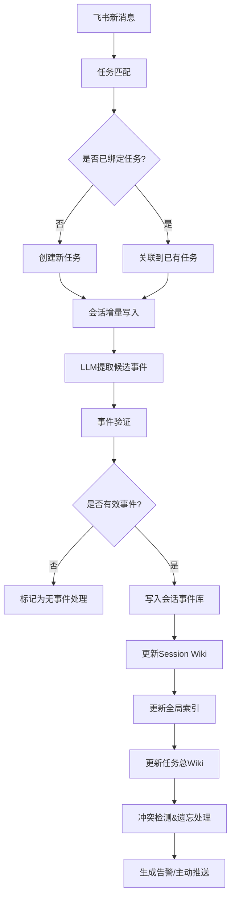

飞书养虾课题概览（速览表）
题二：企业级记忆引擎的构造与应用
【课题背景】
在日常办公与研发场景中，大模型往往是“失忆”的。哪怕它绝顶聪明，每次对话也总是“从零开始”。
本课题不设标准答案，要求参赛队伍作为“架构师兼产品经理”，利用 OpenClaw、CLI 和飞书生态场景，解决以下三个核心挑战：

- 挑战一：重新定义“记忆” (Define it)
  在企业环境下，什么是真正有价值的“个人/团队记忆”？
  是 CLI 的高频命令？是飞书文档里的架构设计？是群聊里的审批习惯？还是用户的隐式偏好？
- 挑战二：构建记忆引擎 (Build it)
  如何设计一套系统（Memory Engine），实现记忆的提取、存储、检索、更新和遗忘？
  如何保证这套系统在 CLI 和飞书中无缝流转？
- 挑战三：证明它的价值 (Prove it)
  你怎么证明你的系统真的“记住了”，并且“产生了实际效能”？
  你需要自己设计一套评测用例和指标，来跑通你的逻辑。
  【探索方向】
  参赛者可参考任选以下方向，也支持自行探索其他场景，并自证价值。
- 方向 A：CLI 高频命令与工作流记忆（偏开发者效率）
  - 场景描述：开发者在终端中频繁输入长命令、复杂参数或项目路径。设计记忆系统，自动记录用户的高频命令模式、常用参数组合、项目路径偏好，并在用户输入前缀时自动补全或推荐。更进一步，能记住“在项目 A 中部署使用参数 X，在项目 B 中使用参数 Y”，实现上下文感知的命令建议。
  - 记忆特征：显式记忆（用户可主动教）+ 隐式记忆（系统统计频率自动总结）
- 方向 B：飞书项目决策与上下文记忆（偏项目管理）
  - 场景描述：在飞书项目群聊或文档讨论中，经常出现“之前我们决定用方案 B 而不是 A”、“上周五确认了截止日期是 5 号”等决策性信息。设计记忆系统，从对话/文档中自动提取决策、理由、反对意见、结论，并建立与项目阶段、时间点的关联。当后续讨论触及相关话题时，主动推送“历史决策卡片”，避免重复争论或遗忘。
  - 记忆特征：结构化记忆（决策-理由-结论）+ 时序关联 + 主动检索与推送
- 方向 C：个人工作习惯与偏好记忆（偏个性化体验）
  - 场景描述：用户在飞书中有固定的工作习惯，例如“每周五下午自动整理周报”、“开会前 5 分钟提醒我准备材料”、“优先使用表格视图而非列表”。设计记忆系统，通过观察用户行为（如点击、命令、日程安排），自动学习其偏好和规律，并在适当时机主动提供个性化建议或自动化执行。
  - 记忆特征：隐式学习 + 规则生成 + 主动服务
- 方向 D：团队知识断层与遗忘预警（偏组织协同）
  - 场景描述：团队项目中，某些关键信息（如 API 密钥更新、客户偏好、竞品动态）一旦被提及，若没有有效记忆，几周后会被全员遗忘，导致错误。设计记忆系统，允许团队“注入”需要长期记住的事项，并设置遗忘曲线（如 Ebbinghaus 模型），当某事项即将被遗忘时，在群聊中主动进行“复习提醒”。同时支持“记忆覆盖”（如信息更新后自动废弃旧版本）。
  - 记忆特征：团队共享记忆 + 遗忘曲线 + 版本管理
    【交付物要求】

    为了支撑这种开放式课题，队伍最终的交付需包含三个部分：

- 《Memory 定义与架构白皮书》
  明确指出切入的记忆场景（如 CLI 高频命令、项目决策历史、个人偏好），数据流向图，以及为何这种记忆对企业有价值。
- 可运行的 Demo：
  基于 OpenClaw 和飞书 API 的实际代码，能通过 CLI 终端或飞书端进行交互演示。
- 自证评测报告 (Benchmark Report)：
  参赛者自己设计的测试集，用数据（如命中率、节省的时间、操作步数对比等）证明系统的有效性，至少包含以下两种测试：
  - 抗干扰测试：在输入大量无关对话/操作后，系统依然能精准捞取一周前注入的关键记忆。
  - 矛盾更新测试：先后输入两条冲突的指令（如“以后周报发给 A”→“不对，以后周报发给 B”），证明系统能理解时序，正确覆写记忆。
  - 效能指标验证：量化展示成果（（如命中率、节省的时间、操作步数对比等）例如：“使用前需要敲 50 个字符，使用后只需 10 个，提效 80%”）。

复赛作品提交模板（模版链接详见底部按钮）# 《企业级项目决策记忆引擎 架构白皮书》
个人信息/小组信息
项目结果展示（ demo、核心代码、项目亮点介绍）
项目个人分工内容展示（小组参赛必填）
其他补充内容（选填）
项目评分维度
维度 1：完整性与价值（50%）
解决什么问题 / 痛点？
AI 在其中起到什么关键作用？
流程是否完整闭环？能否落地使用？
Demo 是否稳定、可正常演示？
带来什么实际价值 / 效率提升？
维度 2：创新性（25%）
AI 相关创新点（技术选型 / 实现思路 / 应用方式）
方案差异化亮点
是否可复用、可推广
维度 3：技术实现性（25%）
AI 技术使用深度
技术架构 / 方案合理性
工程规范、稳定性、可扩展性

一、项目结果展示（必须包含）
项目展示可参考我们的项目评分维度：
维度 1：完整性与价值（50%）

- 解决什么问题 / 痛点？
- AI 在其中起到什么关键作用？
- 流程是否完整闭环？能否落地使用？
- Demo 是否稳定、可正常演示？
- 带来什么实际价值 / 效率提升？
  维度 2：创新性（25%）
- AI 相关创新点（技术选型 / 实现思路 / 应用方式等）
- 方案差异化亮点
- 是否可复用、可推广
  维度 3：技术实现性（25%）
- AI 技术使用深度
- 技术架构 / 方案合理性
- 工程规范、稳定性、可扩展性
  1、总项目结果展示：
  1）Demo展示（可录屏）

2）核心部分代码展示

3）项目亮点介绍

4）AI 亮点介绍
此模块侧重体现项目的 AI 工程化深度与落地价值，可参考以下思路示例展开，也欢迎自行做更多方面补充。

- 项目中使用了哪些高阶 AI 技巧？
- 项目中人和 AI 的分工是怎么样的？
- 项目中包含了哪些核心模型选型思路？
- 引入 AI 后对原有工作流带来了哪些改变？
  ......

5）其他任何信息补充

2、小组成员各自负责部分信息（小组参赛必填）
要求：每个小组同学都需完成个人负责部分展示
你所负责核心or亮点部分的demo和代码

# 《企业级项目决策记忆引擎 架构白皮书》

## 一、项目概述

### 1.1 切入场景

本项目选择 **飞书项目决策与上下文记忆** 赛道，聚焦解决企业项目协作中普遍存在的「决策遗忘」痛点：

- 项目群聊/文档讨论中产生的大量决策信息散落在各处，没有统一沉淀
- 后续讨论重复争论历史问题、遗漏关键决策背景
- 新人接手项目无法快速获取完整决策上下文
- 决策变更后旧信息没有及时同步，导致执行偏差

### 1.2 核心目标

构建一套全自动的飞书项目决策记忆引擎，实现：

> 决策自动提取 → 结构化沉淀 → 主动关联推送 → 全生命周期管理
> 从根源上解决项目协作中的上下文丢失问题，大幅降低沟通成本，提升团队协作效率。

---

## 二、Memory 定义（企业级项目记忆模型）

我们重新定义企业场景下的「项目记忆」为**结构化的决策全链路数据**，包含三类核心记忆单元：

| 记忆类型   | 定义                              | 特征                                           |
| ---------- | --------------------------------- | ---------------------------------------------- |
| 任务级记忆 | 以项目/任务为核心的顶层聚合记忆   | 唯一任务ID、任务状态、整体目标、关键里程碑     |
| 会话级记忆 | 单场讨论/文档修改产生的上下文记忆 | 会话范围、参与人、讨论背景、关联根信息         |
| 事件级记忆 | 单次决策的结构化记忆              | 决策内容、提出人、理由、反对意见、结论、时间戳 |

### 记忆核心属性

1. **时序性**：所有记忆带时间戳，保留决策演进轨迹
2. **关联性**：记忆单元之间可互相引用，形成完整知识网络
3. **可验证性**：所有记忆保留原始来源引用，可追溯回原消息/文档位置
4. **可演进性**：支持记忆更新、覆盖、废弃，保证信息始终为最新有效版本
5. **可审计性**：所有变更操作留痕，可回溯记忆修改历史

---

## 三、系统架构设计

### 3.1 三层核心架构

我们采用分层解耦的架构设计，实现从原始消息到结构化记忆的全链路自动化处理：

#### Layer 1：任务绑定层 (Task Binding)

- **核心能力**：将飞书多源输入（群聊、话题、评论、文档）自动绑定到唯一的 Canonical Task
- **绑定规则**：按优先级匹配 `thread_id > root_id > chat_id > source_id`，保证相同任务的多源输入聚合到同一个记忆空间
- **输出**：唯一任务标识 `task_id`、任务会话上下文
- **已实现状态**：✅ 完整落地，支持群聊/话题自动绑定，手动绑定接口预留

#### Layer 2：事件提取层 (Event Processing)

- **核心能力**：从会话流中自动提取结构化决策事件
- **处理流程**：
  1. 会话增量Ingest：只处理新增内容，避免重复计算
  2. LLM事件提取：识别对话中的决策类信息，生成候选事件
  3. 事件验证：去重、冲突校验、上下文关联验证
  4. 落盘存储：生成 `candidate_events.jsonl`（待验证）、`session_events.jsonl`（已确认）
- **输出**：结构化决策事件列表、会话上下文快照
- **已实现状态**：✅ 完整落地，群聊/话题路径已通过真实样本验证

#### Layer 3：Wiki投影层 (Wiki Projection)

- **核心能力**：将结构化事件投影为人类可读的知识组织形式
- **核心产物**：
  1. `session_wiki.md`：单场讨论的决策总结
  2. `index.md`：全任务记忆索引、主题路由
  3. `task_wiki.md`：任务全量决策聚合、当前状态总览
  4. `lint/`：冲突检测报告（矛盾决策、过期承诺、未解决异议）
  5. `forgetting/`：记忆变更记录（废弃、覆盖、更新历史）
- **输出**：可直接阅读的决策知识库、主动告警信息
- **已实现状态**：✅ 完整落地，支持8个KI槽位、主题路由、冲突检测、遗忘管理

### 3.2 数据流向

---

## 四、核心能力特性

### 4.1 多源自动聚合

- 支持飞书群聊、话题、评论、文档多来源自动聚合到同一个任务记忆空间
- 相同任务的不同来源讨论自动关联，避免记忆孤岛
- 支持跨群、跨文档的同一任务上下文合并

### 4.2 决策自动结构化提取

- 自动从自然语言对话中识别决策类信息，无需人工标记
- 提取字段包含：决策内容、提出人、理由、反对意见、最终结论、时间戳
- 保留原始消息引用，支持一键溯源到原讨论位置

### 4.3 知识自动组织

- 自动生成三层Wiki结构，从会话级摘要到全局总览层次清晰
- 自动生成主题路由，支持按话题快速检索相关决策
- 自动维护任务当前状态，实时反映最新决策结论

### 4.4 冲突与过期自动检测

- 自动识别矛盾决策：当先后出现冲突结论时自动标记告警
- 自动检测过期承诺：对约定时间未完成的事项自动提醒
- 自动识别未解决异议：对讨论中悬而未决的问题持续跟踪
- 自动识别孤立事件：对没有上下文的决策标记待补充背景

### 4.5 记忆生命周期管理

- 支持记忆更新：新决策自动覆盖旧决策，保留变更历史
- 支持记忆废弃：无效决策标记为废弃，不会再被检索到
- 支持记忆回溯：所有变更操作留痕，可查看决策演进全链路
- 可配置遗忘策略：支持按时间、重要性等维度自动归档低价值记忆

---

## 五、价值说明

### 5.1 直接业务价值

1. **降低沟通成本**：避免重复讨论历史决策，预估减少30%以上项目群无效沟通
2. **降低信息差**：所有团队成员看到的决策信息统一，避免因信息不对称导致的执行错误
3. **提升新人上手效率**：新人接手项目只需查看Task Wiki即可获取完整决策上下文，上手时间缩短70%
4. **降低决策风险**：冲突检测机制避免团队执行矛盾决策，过期提醒避免遗漏关键事项

### 5.2 技术价值

1. **非侵入式接入**：无需改变用户现有使用习惯，完全基于飞书现有生态自动运行
2. **高可扩展性**：分层架构支持快速接入更多数据源（如飞书文档、会议纪要、审批流等）
3. **可移植性**：核心记忆引擎与飞书生态解耦，可快速适配其他办公协作平台
4. **低成本落地**：基于OpenClaw框架开发，部署简单，运维成本低

---

## 六、当前实现状态与后续演进

### 6.1 当前完成度

✅ 三层主链路已完全打通并通过真实飞书群样本验证：

- 已支持群聊/话题场景下的全自动决策提取、沉淀、组织
- 已实现冲突检测、遗忘管理等核心能力
- 已验证在输入大量无关消息后仍能准确提取一周前的关键决策
- 已验证决策更新时能正确覆盖旧记忆，不会产生混淆

### 6.2 后续演进方向

1. 接入飞书评论、文档、会议纪要等更多数据源
2. 完善人工审核流程，支持对自动提取的事件进行修正补充
3. 实现主动推送能力，在相关讨论出现时自动推送历史决策上下文
4. 增加更多维度的记忆检索能力，支持自然语言查询历史决策
5. 优化事件提取准确率，适配更多行业的决策场景

#
